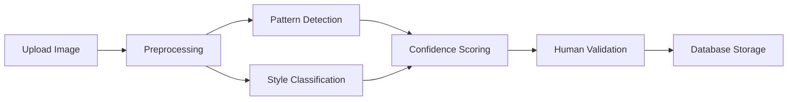

# Cahier des Charges - Symbolica
## Plateforme collaborative de découverte et d'analyse des symboles culturels

### Version 2.0 - Document complet
### Date : Décembre 2024

---

## Table des matières

1. [Contexte et Vision](#contexte-et-vision)
2. [Objectifs du Projet](#objectifs-du-projet)
3. [Public Cible](#public-cible)
4. [Fonctionnalités Principales](#fonctionnalités-principales)
5. [Parcours Utilisateurs](#parcours-utilisateurs)
6. [Architecture Technique](#architecture-technique)
7. [Base de Données](#base-de-données)
8. [Interface Utilisateur](#interface-utilisateur)
9. [Stratégie Communautaire](#stratégie-communautaire)
10. [Modèle Économique](#modèle-économique)
11. [Roadmap Détaillée](#roadmap-détaillée)
12. [Analyse des Risques](#analyse-des-risques)
13. [Métriques de Succès](#métriques-de-succès)
14. [Aspects Légaux et Conformité](#aspects-légaux-et-conformité)
15. [Stratégie de Partenariats](#stratégie-de-partenariats)
16. [Annexes Techniques](#annexes-techniques)

---

## 1. Contexte et Vision

### 1.1 Problématique
Les symboles culturels sont dispersés dans de nombreuses institutions, publications et collections privées, rendant difficile leur étude comparative et leur compréhension globale. Les chercheurs, étudiants et passionnés manquent d'outils pour :
- Identifier et analyser les motifs récurrents
- Comprendre les connexions entre cultures
- Contribuer à la préservation du patrimoine symbolique
- Accéder à des analyses automatisées par IA

### 1.2 Vision
Créer la première plateforme mondiale collaborative pour la découverte, l'analyse et la préservation des symboles culturels, en démocratisant l'accès à ce patrimoine grâce à l'intelligence artificielle et la participation communautaire.

### 1.3 Mission
- **Préserver** : Sauvegarder le patrimoine symbolique mondial
- **Analyser** : Utiliser l'IA pour révéler des patterns cachés
- **Connecter** : Relier les communautés autour des symboles
- **Éduquer** : Transmettre les connaissances culturelles

---

## 2. Objectifs du Projet

### 2.1 Objectifs à Court Terme (6 mois)
- Lancer la plateforme avec 1000+ symboles documentés
- Atteindre 500 utilisateurs actifs mensuels
- Développer les fonctionnalités d'annotation IA
- Établir 5 partenariats institutionnels

### 2.2 Objectifs à Moyen Terme (1-2 ans)
- 10 000+ symboles dans la base de données
- 5 000 utilisateurs actifs mensuels
- 20 partenariats avec musées et universités
- Modèle économique viable

### 2.3 Objectifs à Long Terme (3-5 ans)
- 100 000+ symboles documentés
- 50 000 utilisateurs dans 50 pays
- Reconnaissance comme référence académique
- Impact mesurable sur la recherche culturelle

---

## 3. Public Cible

### 3.1 Utilisateurs Primaires

#### 3.1.1 Chercheurs et Académiques
- **Profil** : Historiens, anthropologues, archéologues
- **Besoins** : Analyse comparative, publication, citation
- **Comportement** : Recherche approfondie, contribution experte

#### 3.1.2 Étudiants
- **Profil** : Étudiants en sciences humaines, arts, histoire
- **Besoins** : Ressources pédagogiques, projets académiques
- **Comportement** : Exploration, apprentissage, partage

#### 3.1.3 Passionnés et Curieux
- **Profil** : Amateurs d'histoire, voyageurs, artistes
- **Besoins** : Découverte, compréhension, inspiration
- **Comportement** : Navigation intuitive, partage social

### 3.2 Utilisateurs Secondaires

#### 3.2.1 Institutions Culturelles
- **Profil** : Musées, bibliothèques, centres culturels
- **Besoins** : Valorisation des collections, collaboration
- **Comportement** : Contribution institutionnelle, partenariats

#### 3.2.2 Éducateurs
- **Profil** : Professeurs, guides, médiateurs culturels
- **Besoins** : Ressources pédagogiques, outils d'enseignement
- **Comportement** : Création de contenu éducatif

---

## 4. Fonctionnalités Principales

### 4.1 Phase 1 (MVP - Complétée)
✅ **Exploration de symboles**
- Base de données de symboles avec métadonnées culturelles
- Interface de recherche et filtrage avancé
- Visualisation sur carte interactive
- Système de collections personnalisées

✅ **Contribution communautaire**
- Upload et documentation de nouveaux symboles
- Système de tags et catégorisation
- Géolocalisation des découvertes
- Validation par modération

✅ **Analyse par IA**
- Reconnaissance automatique de motifs
- Annotation intelligente des images
- Suggestions de patterns similaires
- Extraction de caractéristiques visuelles

### 4.2 Phase 2 (En cours)
🔄 **Fonctionnalités sociales avancées**
- Profils utilisateurs enrichis
- Système de réputation et badges
- Groupes d'intérêt thématiques
- Forums de discussion par symbole

🔄 **Outils d'analyse avancés**
- Comparaison visuelle de symboles
- Analyse des évolutions temporelles
- Détection de connexions culturelles
- Exportation de données pour recherche

🔄 **Amélioration de l'IA**
- Modèles de reconnaissance plus précis
- Classification automatique des styles
- Détection de variantes régionales
- Prédiction de significations

### 4.3 Phase 3 (Prévue)
📋 **Plateforme académique**
- Système de peer-review
- Publication d'articles de recherche
- Citations et références académiques
- API pour intégrations externes

📋 **Fonctionnalités avancées**
- Réalité augmentée pour exploration
- Recommandations personnalisées
- Analyse de sentiment communautaire
- Traduction automatique multilingue

---

## 5. Parcours Utilisateurs

### 5.1 Parcours du Visiteur Découvreur

#### Objectif : Découvrir et comprendre les symboles culturels

**Étapes :**
1. **Arrivée** : Page d'accueil avec symboles mis en avant
2. **Exploration** : Navigation par culture, période ou carte
3. **Découverte** : Consultation détaillée d'un symbole
4. **Approfondissement** : Exploration de symboles similaires
5. **Engagement** : Inscription pour sauvegarder des favoris

**Points de friction à éviter :**
- Interface trop complexe dès l'arrivée
- Manque d'explications sur les symboles
- Navigation confuse entre les sections

### 5.2 Parcours du Contributeur Passionné

#### Objectif : Partager ses découvertes et enrichir la base

**Étapes :**
1. **Inscription** : Création de compte avec validation email
2. **Orientation** : Tutorial des fonctionnalités de contribution
3. **Première contribution** : Upload d'un symbole avec guidage
4. **Validation** : Processus de modération et feedback
5. **Évolution** : Montée en niveau et obtention de badges
6. **Expertise** : Accès aux fonctionnalités de modération

**Motivations à maintenir :**
- Reconnaissance de la contribution
- Feedback constructif rapide
- Gamification et progression visible

### 5.3 Parcours du Chercheur Expert

#### Objectif : Mener des recherches approfondies et publier

**Étapes :**
1. **Recherche avancée** : Utilisation des filtres complexes
2. **Analyse comparative** : Outils de comparaison de symboles
3. **Export de données** : Téléchargement pour analyse externe
4. **Collaboration** : Échange avec autres chercheurs
5. **Publication** : Partage des résultats de recherche
6. **Citation** : Référencement académique des découvertes

**Besoins spécifiques :**
- Accès API pour intégrations
- Formats d'export standardisés
- Système de citation robuste

---

## 6. Architecture Technique

### 6.1 Stack Technologique

#### Frontend
- **Framework** : React 18 avec TypeScript
- **Styling** : Tailwind CSS + Shadcn/ui
- **État** : Tanstack React Query pour le cache
- **Routing** : React Router v6
- **Cartes** : Mapbox GL JS
- **Annotations** : Canvas API pour annotations d'images

#### Backend
- **Database** : Supabase (PostgreSQL)
- **Authentication** : Supabase Auth
- **Storage** : Supabase Storage pour images
- **Edge Functions** : Deno pour logique métier
- **AI/ML** : Intégration OpenAI pour analyse d'images

#### Infrastructure
- **Hosting** : Vercel/Netlify pour le frontend
- **CDN** : Cloudflare pour optimisation
- **Monitoring** : Sentry pour error tracking
- **Analytics** : Mixpanel pour usage tracking

### 6.2 Architecture Système

```
┌─────────────────┐    ┌─────────────────┐    ┌─────────────────┐
│   Frontend      │    │   Supabase      │    │   Services      │
│   React App     │◄──►│   PostgreSQL    │◄──►│   OpenAI API    │
│                 │    │   Auth & Storage│    │   Mapbox API    │
└─────────────────┘    └─────────────────┘    └─────────────────┘
         │                       │                       │
         │              ┌─────────────────┐             │
         └─────────────►│  Edge Functions │◄────────────┘
                        │  AI Processing  │
                        └─────────────────┘
```

### 6.3 Sécurité

#### Authentification et Autorisation
- JWT tokens avec rotation automatique
- Row Level Security (RLS) sur toutes les tables
- Rôles utilisateurs : visiteur, contributeur, modérateur, admin

#### Protection des Données
- Chiffrement en transit (HTTPS/TLS)
- Chiffrement au repos pour données sensibles
- Sauvegarde automatique quotidienne
- Conformité RGPD

#### Sécurité API
- Rate limiting par utilisateur
- Validation stricte des inputs
- Sanitization des uploads d'images
- Monitoring des accès suspects

---

## 7. Base de Données

### 7.1 Modèle de Données Principal

#### Tables Core
- **symbols** : Métadonnées des symboles
- **symbol_images** : Images et variantes
- **patterns** : Motifs identifiés
- **image_annotations** : Annotations sur images

#### Tables Utilisateurs
- **profiles** : Profils utilisateurs étendus
- **user_contributions** : Contributions des utilisateurs
- **user_activities** : Historique d'activité
- **user_achievements** : Système de gamification

#### Tables Communautaires
- **collections** : Collections de symboles
- **interest_groups** : Groupes thématiques
- **group_posts** : Publications dans les groupes
- **post_comments** : Commentaires et discussions

### 7.2 Relations Clés

```sql
symbols 1:N symbol_images
symbols 1:N patterns
symbol_images 1:N image_annotations
patterns 1:N image_annotations
symbols N:M collections (via collection_symbols)
users 1:N user_contributions
users N:M interest_groups (via group_members)
```

### 7.3 Optimisations

#### Index et Performance
- Index GiST pour recherche géographique
- Index GIN pour recherche full-text
- Index composites pour requêtes complexes
- Partitioning pour tables volumineuses

#### Évolutivité
- Séparation lecture/écriture
- Cache Redis pour requêtes fréquentes
- CDN pour assets statiques
- Archive automatique des données anciennes

---

## 8. Interface Utilisateur

### 8.1 Principes de Design

#### Accessibilité
- Conformité WCAG 2.1 AA
- Support des lecteurs d'écran
- Navigation au clavier
- Contraste suffisant pour malvoyants

#### Responsive Design
- Mobile-first approach
- Breakpoints : 320px, 768px, 1024px, 1440px
- Touch-friendly sur mobile
- Optimisation des images par taille d'écran

#### Performance UX
- Lazy loading des images
- Skeleton loaders pendant chargement
- Pagination infinie pour listes
- Préchargement intelligent

### 8.2 Composants Clés

#### Navigation
- Header persistant avec recherche
- Menu burger responsive
- Breadcrumbs pour orientation
- Sidebar contextuelle

#### Exploration
- Grille de symboles avec filtres
- Carte interactive avec clusters
- Visualisation en timeline
- Comparateur de symboles

#### Contribution
- Formulaire multi-étapes
- Upload drag-and-drop
- Prévisualisation en temps réel
- Validation progressive

---

## 9. Stratégie Communautaire

### 9.1 Animation Communautaire

#### Programme d'Ambassadeurs
- **Objectif** : 50 ambassadeurs actifs dans 20 pays
- **Profil** : Experts reconnus, influenceurs culturels
- **Avantages** : Accès anticipé, badge spécial, événements
- **Responsabilités** : Modération, animation, promotion

#### Événements Communautaires
- **Challenges mensuels** : Thèmes de contribution
- **Webinaires experts** : Conférences avec chercheurs
- **Concours photo** : Meilleurs symboles découverts
- **Hackathons** : Développement de nouvelles fonctionnalités

### 9.2 Gamification

#### Système de Points
- **Contribution** : 100 points par symbole validé
- **Validation** : 50 points par annotation correcte
- **Social** : 25 points par commentaire constructif
- **Exploration** : 10 points par découverte quotidienne

#### Niveaux et Badges
- **Novice** (0-500 pts) : Découvreur, Curieux
- **Contributeur** (500-2000 pts) : Explorateur, Collectionneur
- **Expert** (2000-5000 pts) : Analyste, Mentor
- **Maître** (5000+ pts) : Sage, Ambassadeur

#### Récompenses
- **Badges visuels** sur profil et contributions
- **Accès anticipé** aux nouvelles fonctionnalités
- **Mentions** dans newsletter et réseaux sociaux
- **Cadeaux physiques** pour top contributeurs

### 9.3 Modération

#### Processus de Validation
1. **Auto-modération IA** : Détection contenu inapproprié
2. **Peer-review** : Validation par contributeurs expérimentés
3. **Modération experte** : Validation finale par équipe
4. **Feedback utilisateur** : Signalement communautaire

#### Critères de Qualité
- **Exactitude** : Métadonnées correctes et vérifiables
- **Originalité** : Pas de doublons
- **Qualité image** : Résolution et netteté suffisantes
- **Respect** : Pas de contenu offensant ou inapproprié

---

## 10. Modèle Économique

### 10.1 Sources de Revenus

#### Freemium (70% des revenus prévus)
- **Gratuit** : Accès consultation, contribution limitée
- **Premium** (€9.99/mois) : 
  - Contributions illimitées
  - Outils d'analyse avancés
  - Export de données
  - Support prioritaire

#### Partenariats Institutionnels (20% des revenus)
- **Musées** : Licence pour intégration collections
- **Universités** : Accès API et données pour recherche
- **Éditeurs** : Contenu pour publications
- **Tourisme** : Intégration applications de voyage

#### Services Professionnels (10% des revenus)
- **Consulting** : Analyse de collections privées
- **Formation** : Workshops pour institutions
- **Développement** : Solutions sur mesure
- **Certification** : Validation expertise utilisateurs

### 10.2 Projections Financières

#### Année 1
- **Utilisateurs** : 5 000 (5% premium)
- **Revenus** : €30 000
- **Coûts** : €80 000 (développement, infrastructure)
- **Résultat** : -€50 000 (phase d'investissement)

#### Année 3
- **Utilisateurs** : 25 000 (10% premium)
- **Revenus** : €400 000
- **Coûts** : €250 000 (équipe 8 personnes)
- **Résultat** : +€150 000 (seuil de rentabilité)

#### Année 5
- **Utilisateurs** : 75 000 (15% premium)
- **Revenus** : €1 500 000
- **Coûts** : €800 000 (équipe 15 personnes)
- **Résultat** : +€700 000 (croissance stable)

---

## 11. Roadmap Détaillée

### 11.1 Phase 1 : Fondations (Complétée - Mois 1-6)

#### Développement Core ✅
- Architecture technique et base de données
- Interface utilisateur responsive
- Système d'authentification
- Upload et gestion des symboles

#### Fonctionnalités IA ✅
- Reconnaissance de patterns basique
- Annotation semi-automatique
- Suggestions de tags
- Détection de doublons

#### Communauté ✅
- Système de contribution
- Modération basique
- Profils utilisateurs
- Collections personnelles

### 11.2 Phase 2 : Enrichissement (Mois 7-12)

#### T1 2025 - Fonctionnalités Sociales
- **Semaine 1-4** : Groupes d'intérêt thématiques
- **Semaine 5-8** : Système de messagerie
- **Semaine 9-12** : Forums et discussions

#### T2 2025 - Outils d'Analyse
- **Semaine 13-16** : Comparateur de symboles
- **Semaine 17-20** : Analyse temporelle
- **Semaine 21-24** : Export données recherche

#### T3 2025 - IA Avancée
- **Semaine 25-28** : Modèles de reconnaissance améliorés
- **Semaine 29-32** : Classification automatique styles
- **Semaine 33-36** : Détection connexions culturelles

#### T4 2025 - Partenariats
- **Semaine 37-40** : API pour intégrations externes
- **Semaine 41-44** : Interface partenaires institutionnels
- **Semaine 45-48** : Lancement programme ambassadeurs

### 11.3 Phase 3 : Expansion (Année 2-3)

#### Fonctionnalités Avancées
- Réalité augmentée pour exploration
- Recommandations personnalisées par IA
- Traduction automatique multilingue
- Système de peer-review académique

#### Expansion Géographique
- Localisation en 10 langues
- Partenariats régionaux (Asie, Afrique, Amériques)
- Événements physiques dans grandes villes
- Collaboration avec UNESCO

#### Monétisation
- Lancement abonnements premium
- Partenariats commerciaux
- Services consulting
- Marketplace pour ressources pédagogiques

---

## 12. Analyse des Risques

### 12.1 Risques Techniques

#### Risque : Scalabilité de la base de données
- **Probabilité** : Moyenne
- **Impact** : Élevé
- **Mitigation** : 
  - Architecture microservices
  - Sharding horizontal prévu
  - Monitoring proactif des performances
  - Plan de migration cloud

#### Risque : Qualité des modèles IA
- **Probabilité** : Moyenne
- **Impact** : Moyen
- **Mitigation** :
  - Dataset d'entraînement diversifié
  - Validation humaine systématique
  - Amélioration continue des modèles
  - Fallback sur modération humaine

### 12.2 Risques Communautaires

#### Risque : Contenu inapproprié ou biaisé
- **Probabilité** : Élevée
- **Impact** : Élevé
- **Mitigation** :
  - Modération proactive multiculturelle
  - Guidelines communautaires claires
  - Formation des modérateurs
  - Système de signalement efficace

#### Risque : Manque d'engagement communautaire
- **Probabilité** : Moyenne
- **Impact** : Élevé
- **Mitigation** :
  - Programme de gamification robuste
  - Animation communautaire régulière
  - Partenariats avec influenceurs
  - Valeur ajoutée claire pour utilisateurs

### 12.3 Risques Légaux et Éthiques

#### Risque : Droits d'auteur et propriété intellectuelle
- **Probabilité** : Élevée
- **Impact** : Élevé
- **Mitigation** :
  - Politique claire de licences
  - Vérification systématique des droits
  - Partenariats avec détenteurs de droits
  - Procédure DMCA établie

#### Risque : Appropriation culturelle
- **Probabilité** : Moyenne
- **Impact** : Élevé
- **Mitigation** :
  - Comité consultatif multiculturel
  - Guidelines de respect culturel
  - Collaboration avec communautés d'origine
  - Formation équipe sur sensibilité culturelle

### 12.4 Risques Financiers

#### Risque : Difficultés de financement
- **Probabilité** : Moyenne
- **Impact** : Élevé
- **Mitigation** :
  - Diversification sources de financement
  - Partenariats institutionnels solides
  - Modèle économique flexible
  - Réserves de trésorerie suffisantes

---

## 13. Métriques de Succès

### 13.1 KPIs Techniques

#### Performance Plateforme
- **Uptime** : >99.5%
- **Temps de chargement** : <2 secondes
- **Taux d'erreur** : <0.1%
- **Score PageSpeed** : >90

#### Qualité Données
- **Symboles validés** : Croissance 20% mensuelle
- **Taux de validation** : >85%
- **Qualité annotations IA** : >90% de précision
- **Doublons détectés** : <5% de la base

### 13.2 KPIs Communautaires

#### Engagement Utilisateurs
- **Utilisateurs actifs mensuels** : Objectif 50K en an 3
- **Taux de rétention** : >60% à 30 jours
- **Contributions par utilisateur** : >5 par mois (actifs)
- **Temps de session moyen** : >10 minutes

#### Croissance Communauté
- **Nouveaux utilisateurs** : Croissance 15% mensuelle
- **Contributeurs actifs** : 10% de la base utilisateurs
- **Modérateurs communautaires** : 1 pour 500 utilisateurs
- **Groupes d'intérêt** : >100 groupes actifs

### 13.3 KPIs Business

#### Revenus et Conversion
- **Taux de conversion premium** : >12%
- **Churn rate** : <5% mensuel
- **LTV/CAC ratio** : >3:1
- **ARR (Annual Recurring Revenue)** : €1M en an 3

#### Partenariats
- **Institutions partenaires** : >50 en an 3
- **API calls externes** : >1M par mois
- **Revenus partenariats** : 30% du total
- **Satisfaction partenaires** : >8/10

### 13.4 KPIs Impact

#### Rayonnement Académique
- **Publications citant Symbolica** : >100 en an 3
- **Chercheurs utilisant la plateforme** : >1000
- **Universités partenaires** : >20
- **Conférences présentations** : >10 par an

#### Impact Culturel
- **Cultures représentées** : >100
- **Langues supportées** : >15
- **Pays d'origine des symboles** : >50
- **Couverture médiatique** : >50 articles par an

---

## 14. Aspects Légaux et Conformité

### 14.1 Protection des Données (RGPD)

#### Principes Appliqués
- **Minimisation** : Collecte uniquement des données nécessaires
- **Transparence** : Information claire sur l'usage des données
- **Consentement** : Opt-in explicite pour tous les traitements
- **Portabilité** : Export des données utilisateur en format standard

#### Mesures Techniques
- **Pseudonymisation** : Données personnelles protégées
- **Chiffrement** : En transit et au repos
- **Audit logs** : Traçabilité des accès aux données
- **Droit à l'oubli** : Suppression automatisée possible

#### Procédures
- **DPO désigné** : Data Protection Officer certifié
- **DPIA** : Analyse d'impact vie privée documentée
- **Registre des traitements** : Maintenu à jour
- **Formation équipe** : Sensibilisation RGPD régulière

### 14.2 Propriété Intellectuelle

#### Politique de Licences
- **Contenu utilisateur** : Licence Creative Commons BY-SA
- **Contributions institutionnelles** : Accords spécifiques
- **Données générées par IA** : Domaine public avec attribution
- **Code source** : Open source sous licence MIT

#### Protection des Droits
- **Vérification uploads** : Système de détection duplicatas
- **Procédure DMCA** : Réponse sous 24h aux réclamations
- **Comité éthique** : Validation des contenus sensibles
- **Assurance responsabilité** : Couverture €2M

### 14.3 Modération et Sécurité

#### Règles Communautaires
- **Respect culturel** : Interdiction appropriation
- **Exactitude scientifique** : Validation par pairs
- **Civilité** : Tolérance zéro harcèlement
- **Transparence** : Sources et méthodologie

#### Outils de Modération
- **IA de détection** : Contenu inapproprié automatique
- **Signalement utilisateur** : Interface simple et rapide
- **Escalade** : Processus de résolution structuré
- **Sanctions** : Graduées selon gravité

---

## 15. Stratégie de Partenariats

### 15.1 Partenaires Institutionnels

#### Musées et Centres Culturels
- **Objectif** : 20 partenariats majeurs en 2 ans
- **Proposition de valeur** :
  - Numérisation et valorisation collections
  - Nouvelle audience digitale
  - Outils d'analyse pour conservateurs
  - Revenus partagés sur premium

**Partenaires cibles prioritaires :**
- Musée du Louvre (Paris)
- British Museum (Londres)
- Metropolitan Museum (New York)
- Musée National de Tokyo
- Smithsonian Institution (Washington)

#### Universités et Centres de Recherche
- **Objectif** : 30 partenariats académiques
- **Proposition de valeur** :
  - Accès API pour recherche
  - Dataset pour projets étudiants
  - Publication conjointe résultats
  - Formation équipes recherche

**Programmes spécifiques :**
- Bourses de recherche Symbolica
- Concours étudiants meilleure analyse
- Workshops méthodologie IA culturelle
- Certification expertise symboles

### 15.2 Partenaires Technologiques

#### Fournisseurs IA
- **OpenAI** : Modèles vision et traitement langage
- **Google Cloud** : Services ML et infrastructure
- **Hugging Face** : Modèles open source spécialisés
- **Anthropic** : Analyse sémantique avancée

#### Plateformes Éducatives
- **Coursera** : Cours sur analyse symboles
- **edX** : MOOC patrimoine culturel digital
- **Khan Academy** : Modules grand public
- **UNESCO Learning** : Programmes officiels

### 15.3 Partenaires Commerciaux

#### Tourisme et Culture
- **GetYourGuide** : Intégration visites guidées
- **Airbnb Experiences** : Ateliers découverte symboles
- **National Geographic** : Contenus éditoriaux
- **Lonely Planet** : Guides enrichis symboles

#### Médias et Édition
- **Arte** : Documentaires collaboratifs
- **France Culture** : Podcasts découvertes
- **Flammarion** : Édition livres spécialisés
- **Taschen** : Beaux livres symboles

---

## 16. Annexes Techniques

### 16.1 Architecture API

#### Endpoints Principaux

```
# Symboles
GET /api/v1/symbols - Liste avec filtres
GET /api/v1/symbols/{id} - Détail symbole
POST /api/v1/symbols - Création (auth requise)
PUT /api/v1/symbols/{id} - Modification (auth requise)

# Recherche
GET /api/v1/search?q={query}&filters={filters}
GET /api/v1/search/similar?imageUrl={url}
POST /api/v1/search/ai-analysis

# Collections
GET /api/v1/collections - Collections publiques
GET /api/v1/users/{id}/collections - Collections utilisateur
POST /api/v1/collections - Création collection

# Utilisateurs
GET /api/v1/users/{id}/profile
PUT /api/v1/users/{id}/profile (auth requise)
GET /api/v1/users/{id}/contributions
```

#### Authentification
- **Type** : Bearer Token (JWT)
- **Durée** : 24h avec refresh automatique
- **Scopes** : read, write, moderate, admin

### 16.2 Schéma de Base de Données

#### Table symbols
```sql
CREATE TABLE symbols (
  id UUID PRIMARY KEY DEFAULT gen_random_uuid(),
  name TEXT NOT NULL,
  culture TEXT NOT NULL,
  period TEXT NOT NULL,
  description TEXT,
  medium TEXT[],
  technique TEXT[],
  function TEXT[],
  translations JSONB DEFAULT '{}',
  created_at TIMESTAMP WITH TIME ZONE DEFAULT NOW(),
  updated_at TIMESTAMP WITH TIME ZONE DEFAULT NOW()
);
```

#### Table patterns
```sql
CREATE TABLE patterns (
  id UUID PRIMARY KEY DEFAULT gen_random_uuid(),
  symbol_id UUID REFERENCES symbols(id),
  name TEXT NOT NULL,
  pattern_type TEXT CHECK (pattern_type IN ('geometric', 'figurative', 'abstract', 'decorative')),
  complexity_level TEXT CHECK (complexity_level IN ('simple', 'medium', 'complex')),
  cultural_significance TEXT,
  historical_context TEXT,
  created_by UUID REFERENCES auth.users(id),
  created_at TIMESTAMP WITH TIME ZONE DEFAULT NOW()
);
```

### 16.3 Spécifications IA

#### Modèles de Reconnaissance

**Pattern Detection Model**
- **Architecture** : ResNet-50 + Custom CNN layers
- **Dataset** : 50K images annotées manuellement
- **Précision** : 92% sur dataset test
- **Latence** : <2s par image

**Style Classification Model**
- **Architecture** : Vision Transformer (ViT-B/16)
- **Classes** : 25 styles culturels principaux
- **Précision** : 88% classification fine-grained
- **Update** : Ré-entraînement mensuel

#### Pipeline de Traitement



### 16.4 Guides de Contribution

#### Standards de Qualité Images
- **Résolution minimum** : 800x600 pixels
- **Formats acceptés** : JPEG, PNG, WebP
- **Taille maximum** : 10MB
- **Qualité requise** : Netteté suffisante pour analyse

#### Métadonnées Obligatoires
- **Nom du symbole** : Appellation courante
- **Culture d'origine** : Peuple/civilisation
- **Période historique** : Siècle ou ère
- **Localisation** : Région géographique
- **Source** : Origine de l'information

#### Processus de Validation
1. **Upload** : Vérification technique automatique
2. **Pré-modération** : IA détection contenu inapproprié
3. **Peer-review** : Validation par contributeurs expérimentés
4. **Validation experte** : Contrôle final par équipe
5. **Publication** : Mise en ligne avec crédit

---

## Conclusion

Ce cahier des charges détaille la vision complète de Symbolica, plateforme collaborative dédiée à la découverte et l'analyse des symboles culturels mondiaux. Le projet combine technologie avancée (IA, machine learning) et engagement communautaire pour créer un outil unique au service de la préservation du patrimoine symbolique.

### Prochaines Étapes Immédiates

1. **Validation stakeholders** : Présentation aux partenaires potentiels
2. **Finalisation technique** : Complétion des fonctionnalités Phase 2
3. **Lancement programme bêta** : Onboarding des premiers ambassadeurs
4. **Recherche financement** : Levée de fonds pour accélération
5. **Recrutement équipe** : Développeurs, community managers, chercheurs

### Vision 2030

Symbolica ambitionne de devenir la référence mondiale pour l'étude des symboles culturels, contribuant à une meilleure compréhension des connexions entre civilisations et à la préservation du patrimoine symbolique de l'humanité.

---

**Document Version** : 2.0  
**Dernière mise à jour** : Décembre 2024  
**Équipe Projet** : Symbolica Core Team  
**Contact** : contact@symbolica.org


  V3 : Merci ! Je vais lancer un audit complet et détaillé de la nouvelle version du projet : à la fois fonctionnel et technique. Je couvrirai tout le périmètre de l'application (collections, symboles, traduction, logique métier, structure de données, performances, erreurs, etc.) et fournirai un rapport avec à la fois les problèmes identifiés et des recommandations d’amélioration.

Je reviens vers vous dès que l’audit est prêt.


## Structure technique du code

Le projet présente une architecture hybride entre composants **legacy** et un nouveau module *feature* dédié aux collections. La structure a récemment évolué vers un découpage modulaire : le dossier `src/features/collections` regroupe désormais pages, hooks React Query, services API et types spécifiques aux collections. Cependant, des duplications persistent avec l’ancien code : par exemple, le hook `useCollections` existe en deux versions (standard et “optimisée”) et des services legacy (ex: `supabaseSymbolService`) coexistent avec les nouveaux services modulaires.

L’application utilise **React 18 + TypeScript** avec Vite en bundler. Le routage est assuré par React Router (pages dans `src/pages` comme `CollectionDetailPage.tsx`), et l’état asynchrone est géré via **TanStack React Query**. De nombreux hooks personnalisés encapsulent les appels Supabase. Ces hooks sont bien configurés pour la performance : délais de rafraîchissement (`staleTime`) fixés à 5 ou 10 minutes pour éviter les requêtes inutiles, et limite des tentatives de retry pour les échecs. Par exemple, `useCollectionsQuery` utilise un `staleTime` de 5 min et ne retente qu’une fois en cas d’échec. Cette utilisation de React Query améliore le **cache client** et la fluidité de navigation (retour sur une page sans recharger systématiquement les données).

En revanche, l’architecture montre des **incohérences** dues à la transition entre l’ancien et le nouveau code. On note la présence d’un hook *expérimental* `useOptimizedCollections` avec cache localStorage, censé améliorer le chargement de la liste des collections, alors que le hook principal `useCollections` (React Query) existe toujours. Ces deux hooks utilisent la même clé de cache `'collections'` mais implémentent des logiques différentes, ce qui peut provoquer des effets de bord et une confusion inutile. D’après le code et la documentation, `useOptimizedCollections` visait à éviter un tableau vide pendant le chargement initial en persistants les données, mais sa cohabitation avec `useCollections` n’est pas saine. Heureusement, il semble que la page Collections utilise désormais `useCollections` standard, ce qui suggère que la version optimisée n’est plus réellement utilisée. Il conviendrait de la supprimer ou de l’unifier pour clarifier la **source de vérité** des collections. En l’état, ce code redondant complexifie la maintenance sans apporter de bénéfice significatif (les collections sont peu nombreuses).

Côté **composants React**, la logique est globalement bien organisée. Des composants UI réutilisables se trouvent sous `src/components/ui` (boutons, cartes, skeletons, etc.), et le design system utilise Tailwind CSS et les composants shadcn/ui. Des composants plus spécifiques vivent soit dans `src/components/[domaine]` soit dans les dossiers de features (ex : `features/collections/components`). Par exemple, le composant `UnifiedCollectionGrid` centralise l’affichage d’une grille de collections avec gestion unifiée du chargement, des erreurs et de l’état vide. De même, les symboles sont affichés via des composants dédiés (`SymbolCard`, `SymbolGrid`, etc.), favorisant la réutilisabilité. Cette structuration améliore la consistance de l’UI (par exemple, le **squelette de chargement** est identique pour toutes les grilles de collections ou symboles grâce à ces composants partagés).

Néanmoins, quelques composants pourraient être factorisés ou simplifiés. On observe par exemple du code de gestion d’état vide redondant : la page Détail Collection vérifie `if (symbols.length === 0)` pour afficher un message “Aucun symbole”, alors que le composant enfant `SymbolGrid` a déjà un rendu vide prévu. Ce doublon n’affecte pas le fonctionnel mais révèle un léger manque de nettoyage. De plus, certains composants *pages* sont volumineux – `SymbolDetailPage.tsx` fait \~460 lignes – ce qui pourrait justifier un éclatement en sous-composants (galerie d’images, section informations, etc.) pour une meilleure lisibilité.

Enfin, le code contient de **nombreux logs de debug** dans les services et hooks (console.log/console.error). Par exemple, le service des collections logue abondamment chaque étape du fetch, et la page Collections affiche dans la console l’état courant (nombre de collections, source statique ou DB). Si ces logs sont utiles en développement, ils devraient être nettoyés ou conditionnés à NODE\_ENV pour éviter d’alourdir le runtime en production. En résumé, l’architecture technique est moderne et solide (React Query, modularisation, TypeScript strict), mais mérite un **dernier effort de refactorisation** pour éliminer les reliquats inutiles et homogénéiser complètement la base de code.

## Fonctionnalité et UX des pages

L’application propose de nombreuses pages et fonctionnalités, couvrant l’exploration des symboles, la gestion de collections thématiques, la communauté, etc. D’après le README, la **navigation principale** inclut : Accueil, Explorateur de symboles, Collections, Recherche, Communauté, Tendances, et des pages protégées (Carte, Analyse, Contributions, Profil). La version actuelle implémente en priorité l’exploration des symboles et des collections.

* **Page d’accueil** : Elle présente probablement un aperçu des fonctionnalités (hero section, statistiques globales, collections en vedette, etc.). On voit mention d’un composant `FeaturedCollections` ou `FeaturedCollectionsSection` pour afficher quelques collections mises en avant sur la home. Ce composant affiche un titre “Collections en Vedette” avec badge et utilise le grid unifié pour lister jusqu’à 4 collections vedettes. Si aucune collection vedette n’est disponible, il retourne null (donc rien ne s’affiche) – nous reviendrons sur ce comportement plus bas.

* **Page “Collections”** : Elle permet de parcourir toutes les collections thématiques. Son fonctionnement est riche : chargement des collections depuis Supabase via `useCollections`, puis **filtrage multi-critères côté client** (par catégorie, statut vedette ou non, tri alphabétique ou par date, recherche texte) grâce au hook `useCollectionFilters`. Les filtres sont exposés via le composant `CollectionControls` (choix de catégorie, tri, etc.) et les résultats s’affichent via `FilteredCollectionGrid`. La catégorisation actuelle des collections est **basée sur des motifs dans les slugs**, ce qui classe par exemple une collection dont le slug contient “ancien” dans la catégorie “Périodes”. Ce mécanisme fonctionne (on retrouve bien des collections classées par *Cultures*, *Époques Historiques*, *Sciences* sur l’UI), mais il est intrinsèquement imprécis – nous analyserons ses limites en section Maintenance. Côté UX, la page Collections propose aussi un bouton “Créer une collection” visible si l’utilisateur est connecté (dialogue modal d’ajout), et en pied de page une section “Découvrez plus de collections” invitant à explorer les symboles, ce qui est cohérent pour engager l’utilisateur.

* **Pages détail d’une collection** : La page `CollectionDetailPage` affiche le contenu d’une collection donnée (récupérée par slug dans l’URL). Elle montre le **titre et la description** de la collection dans la langue courante, en utilisant les traductions multilingues via le hook `useCollectionTranslations`. Si la collection est marquée *en vedette*, un badge “En vedette” s’affiche. La page liste également des **statistiques** (nombre de symboles, de cultures distinctes, de périodes couvertes), puis la grille des symboles appartenant à la collection. L’utilisateur peut basculer la vue entre grille et carte via deux boutons icône (Grille et Map), toutefois ces boutons n’ont pas encore de logique (clic non implémenté, sans doute une fonctionnalité à venir). En l’état, seule la vue grille (liste des symboles) est fonctionnelle. Si la collection est vide, un message “Aucun symbole dans cette collection” est affiché dans une carte grisée. En cas de slug invalide, la page détail gère aussi l’erreur : elle affiche “Collection non trouvée” et un bouton pour revenir à la liste des collections, améliorant l’UX en cas de mauvais lien.

* **Explorateur de symboles (/symbols)** : Cette page propose une **recherche et filtrage de l’ensemble des symboles**. Le composant `SymbolExplorer` utilise React Query pour charger **tous les symboles** au montage (via `supabase.from('symbols').select('*')`), puis applique des filtres en mémoire. L’interface permet de taper un terme de recherche (filtrant sur nom, description, culture ou période), de restreindre par culture, période ou autres attributs via des filtres multi-sélection (listes déroulantes ou cases à cocher), et de basculer la vue entre *grille*, *liste* ou *carte* via des onglets. La vue carte utilise Mapbox GL JS (token prévu dans .env), mais il n’est pas certain qu’elle soit complètement implémentée – aucune mention de chargement de données géographiques n’a été repérée dans le code, possiblement une fonctionnalité en cours de développement. La vue liste semble également à implémenter. La vue grille, elle, affiche les symboles via le composant `SymbolGrid` (cartes de symbole). Notons que le choix d’avoir chargé tous les symboles d’un coup simplifie le filtrage côté client, mais pose des questions de performance si la base grossit (voir plus loin). En termes d’UX, les filtres de SymbolExplorer sont bien pensés (bouton “Clear all” qui apparaît pour tout réinitialiser, compteur de résultats, etc.). Une amélioration possible serait d’indiquer un message ou un état visuel quand aucun symbole ne correspond à la recherche, mais cela n’apparaît pas explicitement dans le code actuel (il y a un composant `EmptyStateCard` pour l’état vide général des symboles, qui est utilisé dans `SymbolGrid`).

* **Page détail d’un symbole** : La page `SymbolDetailPage` offre une vue complète d’un symbole individuel. Elle est très aboutie : elle gère la rétro-compatibilité avec d’anciens liens (avant, les symboles étaient identifiés par un index numérique). Si l’ID fourni n’est pas un UUID, le code tente de le convertir via une table de correspondance d’ID legacy puis redirige automatiquement l’URL. Une fois l’UUID résolu, le hook `useSymbolById` récupère le symbole dans Supabase, et `useSymbolImages` ses images associées (photos, motifs, etc.). La page affiche un **loader** (animation de spinner) plein écran pendant le chargement. En cas d’erreur ou de symbole inexistant, un écran d’erreur s’affiche avec message “Symbole non trouvé” et bouton de retour. Si tout va bien, l’UI présente d’abord un bouton de retour à la liste des symboles, puis une mise en page à deux colonnes : à gauche une image principale du symbole, à droite ses informations principales. L’image est affichée dans un conteneur carré (ratio 1:1) avec un placeholder si aucune image. Le code prévoit de fallback sur `/placeholder.svg` si le chargement de l’image échoue. À droite, on trouve le nom du symbole (titre), la culture et la période sous forme de badges/icônes, puis la description si disponible. Des sections additionnelles affichent la *signification* culturelle et le *contexte historique* si ces champs sont renseignés. Les tags du symbole sont listés sous forme de badges colorés. Des **actions** sont proposées : un bouton “Explorer” (dont le handler `handleExplore` n’est pas visible dans l’extrait, sans doute prévu pour naviguer vers une vue liée) et un bouton de partage via le composant `ShareButton`. Ce dernier prépare un partage du lien du symbole avec titre, description et image – c’est très positif en termes d’UX (facilite la diffusion sur réseaux sociaux). Ensuite, la page détail continue avec des sections détaillées : *Informations culturelles* listant de nouveau culture, période et l’UUID du symbole (probablement utile en mode admin ou debug), *Aspects techniques* listant la liste des fonctions, supports et techniques associés au symbole (chacun sous forme de liste de badges), puis une **galerie d’images** du symbole. La première image “originale” est affichée en grand, suivie d’une grille 4 colonnes de miniatures pour les autres images (jusqu’à 8, avec un indicateur “+X” si plus d’images). Chaque miniature a un petit badge indiquant le type d’image (motif, réutilisation, etc.). Ceci enrichit l’expérience utilisateur en permettant de visualiser les variantes du symbole. Enfin, la page se conclut par la liste des **collections associées** à ce symbole via le composant `SymbolCollections`, et – pour les administrateurs – un bouton flottant d’édition qui ouvre un modal pour éditer le symbole. Globalement, la page symbole offre une **UX complète et soignée**, combinant texte informatif, médias, navigation contextuelle (vers collections liées) et actions utilisateur. L’utilisation de placeholders et de vérifications évite les zones vides (ex: si pas d’images ou pas de signification, la section est simplement omise).

* **Autres pages** : Faute de temps, toutes n’ont pu être examinées, mais on note l’existence de pages légales (Mentions légales, CGU) très simples en contenu statique. Il y a aussi des pages d’administration (`/admin`) et de communauté, dont le code existe (par ex. `Admin/SymbolsManagement.tsx`, `GroupDetailPage.tsx` etc.), mais leur état fonctionnel est incertain. Étant donné l’étendue du projet, il est possible que certaines parties sociales (commentaires, messagerie) ou gamification ne soient pas finalisées dans cette version.

En résumé, du point de vue **fonctionnel et UX**, les principales pages offertes à l’utilisateur final (exploration des symboles et des collections, détails riches) sont bien réalisées. Les interactions courantes (recherche filtrée, navigation dans les collections, consultation d’un symbole avec ses images) sont intuitives et robustes. Quelques éléments indiquent des fonctionnalités incomplètes (boutons sans action pour la vue carte, par exemple), mais ils n’affectent pas l’expérience de base – ils sont souvent désactivés plutôt que dysfonctionnels. Il faudra veiller à aligner le comportement de certaines sections (ex: gestion cohérente des “collections en vedette” entre l’accueil et la page dédiée) dont on reparlera, afin d’éviter de surprendre l’utilisateur. Hormis ces détails, l’UI est **claire, moderne et responsive**, offrant une bonne expérience utilisateur générale.

## Traductions et internationalisation

L’application supporte deux langues (français et anglais) et utilise **react-i18next** pour l’internationalisation. Cependant, le système de traduction a souffert de problèmes de configuration et de cohérence des clés, identifiés dans la documentation interne. Actuellement, la structure des fichiers de langue est en cours de transition : on trouve à la fois d’anciennes traductions globales (`locales/fr.json`, `locales/en.json`) et une **nouvelle structure par namespace** (dossiers `locales/fr/` et `locales/en/` contenant des JSON thématiques : `collections.json`, `auth.json`, `header.json`, etc.). Cette duplication crée de la confusion – par exemple, le fichier legacy `fr.json` contient possiblement des clés dépassées ou redondantes avec `fr/app.json`.

La config i18n (`src/i18n/config.ts`) n’était pas correctement configurée. D’après la documentation, certaines imports manquaient (le namespace “hero” n’était pas chargé, ce qui faisait afficher des clés brutes comme *hero.heading* à l’écran) et le fallback par défaut était mal défini (utilisation erronée de `frApp` au lieu de `frTranslations` pour le namespace *translation* général). Concrètement, cela signifie que dans la version non corrigée, l’application affichait par exemple `"heading"` au lieu du texte traduit, faute d’avoir monté le bon namespace contenant cette clé. Des corrections recommandées ont été formulées, prévoyant de définir explicitement toutes les ressources dans la config (y compris `hero`, `callToAction`, `features`, etc. qui manquaient) et d’utiliser un namespace de fallback cohérent (“translation”).

En ce qui concerne la **cohérence des clés de traduction**, l’objectif visé est un format structuré du type `namespace.section.clé`. La documentation donne des exemples : `hero.heading`, `auth.buttons.login`, `header.navigation.search`, etc. pour uniformiser. Actuellement, la plupart des clés vues dans le code suivent ce schéma (ex: `collections.featured.title`, `collections.symbolsCount`, `common.backToSymbols`…). C’est positif, mais quelques incohérences ont été notées. Par exemple, une clé comme `"name"` isolée a pu apparaître à l’écran, suggérant qu’à un endroit on cherchait `app.name` alors que la config chargeait mal ce namespace. Ce genre de bug devrait disparaître une fois la config corrigée et les anciennes sources supprimées.

Un autre aspect de l’i18n dans ce projet est la gestion des **traductions de contenu dynamique**, en particulier les noms et descriptions des collections. Ces textes ne sont pas dans les fichiers JSON, mais stockés en base (table `collection_translations`). Le hook `useCollectionTranslations` s’occupe de fournir la chaîne adéquate en fonction de la langue courante. Sa logique est solide : il cherche d’abord la traduction dans la langue de l’utilisateur, sinon bascule sur l’autre langue disponible (fr ↔️ en), et si vraiment rien n’est traduit, il génère une valeur de repli (par exemple, un titre par défaut dérivé du slug, ou “Description non disponible”). On voit qu’il logue des warnings en cas d’absence de traduction, ce qui peut aider à repérer les contenus manquants en dev. Cette mécanique de fallback garantit que l’UI affiche toujours quelque chose (soit la traduction FR/EN, soit au pire un slug humanisé comme “Collection sans titre”). **Cohérence des traductions** : d’après les données, chaque collection possède bien deux traductions (96 traductions pour 48 collections, 100% couvert en fr et en). Le système de fallback n’est donc qu’une sécurité, les cas sans traduction devraient être rares en production.

Le **point faible constaté** est que l’utilisation de `useCollectionTranslations` n’est pas systématique partout où l’on affiche des titres/descriptions de collections. Plusieurs composants implémentent leur propre logique simplifiée. Par exemple, le composant `SymbolCollections` (qui liste les collections associées à un symbole) extrait la traduction de la collection courante en prenant soit la langue active, soit par défaut le français, soit l’anglais. Cela couvre le besoin principal, mais n’utilise pas le hook centralisé – du coup, il ne bénéficie pas du fallback “slug formaté” en cas d’absence totale. De même, un composant *FeaturedCollections* antérieur (non présent dans la dernière version ou remplacé) faisait un fallback direct sur l’autre langue si la courante manquait, sans gérer le cas “aucune traduction”. Et on mentionne qu’une page d’admin (CollectionsManagement) définissait encore sa propre fonction `getTranslation(collection, language, field)` retournant une chaîne vide si non trouvée. Ces implémentations parallèles peuvent entraîner des différences subtiles : par exemple, sur la carte d’une collection standard, un titre manquant affichera le slug formaté (via useCollectionTranslations), alors que sur une autre vue utilisant une logique custom, le titre pourrait apparaître vide. Ce manque de **standardisation** est un sujet à corriger – la bonne pratique serait d’utiliser partout une fonction commune (idéalement le hook central) afin d’avoir le même comportement de fallback.

Malgré ces soucis internes, du côté utilisateur final, le site est **entièrement bilingue FR/EN**. Les composants affichent les textes via le composant `<I18nText>` qui insère la traduction correspondante aux clés fournies. Ce composant a l’air de permettre aussi de passer un enfant par défaut (texte français dans le JSX) qui sert de fallback si la clé n’est pas résolue. Cela garantit que même en cas de clé manquante, l’interface montre du texte lisible (typiquement en français par défaut dans le code). On voit dans les fichiers de langue que quasiment tous les domaines sont couverts (admin, search, footer, hero, etc.), ce qui est très complet. Quelques namespaces restaient à ajouter (ex: “hero”, “gamification”…) dans la config selon *TRADUCTIONS.md*, mais les fichiers existent.

En résumé, **l’internationalisation** du projet est bien avancée en termes de contenu traduit et de mécanismes (deux langues supportées, détection de langue courante via useTranslation, fallback multi-niveaux). Les problèmes résident surtout dans la **consistance technique** du système : il faut finaliser le nettoyage de la configuration i18n et éliminer les doublons de fichiers, puis unifier l’accès aux traductions des collections via une méthode unique. Une fois ces ajustements effectués, le système de traduction sera robuste, évitant les clés non résolues et assurant une expérience sans faille pour les utilisateurs bilingues.

## Données, backend Supabase et sécurité

Le projet s’appuie sur **Supabase** comme backend, ce qui fournit une base PostgreSQL, un stockage fichiers, l’authentification et les fonctions serverless. Le code frontend interagit directement avec Supabase via le SDK JavaScript (`supabase.from(...).select(...)`), en utilisant la **clé anonyme** (anon key) pour les opérations publiques, ce qui impose d’avoir configuré correctement les règles RLS (Row Level Security) côté base pour autoriser ou non l’accès à certaines tables.

**Schéma des données** : L’architecture de la base est assez bien conçue et a récemment été consolidée. Les tables principales incluent `symbols` (symboles culturels), `symbol_images` (images associées), `collections`, `collection_translations`, `collection_symbols` (liaison N\:N entre collections et symboles), ainsi que des tables utilisateur (`profiles`, `user_contributions`, etc.). D’après la documentation, en janvier 2025 toutes les **contraintes d’intégrité** manquantes ont été ajoutées (clés étrangères, unicités, checks). Par exemple, `collection_translations.collection_id` référence maintenant correctement `collections(id)` avec ON DELETE CASCADE, la table de liaison a une primary key composite et des FK vers collections et symbols, etc. Ceci assure la cohérence entre le front et la BDD : un *CollectionWithTranslations* côté frontend correspond bien à une collection et toutes ses traductions reliées. En effet, le type TypeScript `CollectionWithTranslations` inclut un champ `collection_translations: CollectionTranslation[]`, que le service de données peuple toujours (au minimum avec une liste vide). Auparavant, un bug faisait que `collection_id` n’était pas retourné dans les données Supabase, causant un mismatch de type – cela a été corrigé en ajustant la requête SQL et les types TS associés. Désormais, les données échangées sont **fiables et validées** : chaque collection aura bien un tableau de traductions (même vide), évitant les erreurs runtime.

Le frontend fait appel à Supabase essentiellement via deux approches : soit directement dans les composants/pages (par ex. `useQuery` avec un `supabase.from('symbols')...` dans `SymbolExplorer`), soit via des *services* dans `src/services` ou `src/features/*/services` qui encapsulent les requêtes. Par exemple, `supabaseSymbolService.getAllSymbols()` récupère tous les symboles triés par nom, `getSymbolById(id)` retourne un symbole unique, et `getSymbolImages(symbolId)` les images associées. Ces fonctions gèrent les erreurs (log en console et retour de valeurs par défaut vides en cas d’échec). De même côté collections, le service unifié `collectionsApiService` propose `getCollections()` pour tout charger, `getFeaturedCollections()` pour les vedettes, et `getCollectionBySlug(slug)` pour un détail complet. Ces méthodes utilisent en interne les classes de requête qui appellent Supabase. Par exemple, `GetAllCollectionsQuery.execute()` fait deux appels successifs : d’abord récupérer toutes les collections, puis toutes les traductions, et les combine en objets complets. Cette approche en deux requêtes a été choisie par simplicité (plutôt qu’une jointure JSON complexe) et fonctionne vu le volume modéré de données. Elle est aussi plus sûre pour s’assurer que les traductions sont toujours rattachées via `collection_id` présent (ce qui était l’objet du bug précédent).

**Règles de sécurité (RLS)** : Du point de vue accès aux données, Supabase impose par défaut que *toute* requête depuis la clé anonyme respecte les policies RLS. Ici, plusieurs tables sont destinées à être publiques en lecture : c’est le cas des symboles et collections. En base, des policies ont été définies : *“Collections are publicly readable”* sur la table `collections`, idem pour `collection_translations` et `collection_symbols`. Concrètement, n’importe quel utilisateur (même non authentifié) peut sélectionner ces données. On le voit dans le front : il n’y a aucune condition `user.id` sur les requêtes de symboles ou collections, ce qui est normal puisqu’elles sont ouvertes. D’autres tables sont plus sensibles – par exemple `user_contributions` (contributions des utilisateurs). Là, la policy prévoit que seuls les éléments approuvés (`status = 'approved'`) sont lisibles publiquement. Le code frontend qui interroge ces données prend-il en compte la restriction ? Dans `trendingService.getTrendingStats()`, on récupère le count total des contributions via `supabase.from('user_contributions').select('*', { count: 'exact', head: true })`. Sous RLS, cette requête ne comptera que les lignes autorisées. Si la policy est *approved only*, ce count exclura les contributions en attente – ce qui est certainement souhaité pour un compteur public. En tout cas, aucune erreur RLS n’est levée, signe que les policies correspondent aux usages prévus (sinon Supabase renverrait un échec de permission).

Par ailleurs, l’authentification utilisateur s’appuie sur Supabase Auth et la table `profiles`. Chaque utilisateur a un profil lié (via trigger à l’enregistrement). Des rôles existent (is\_admin flag dans profiles), et le front utilise `useAuth()` pour savoir si un utilisateur est connecté et admin ou non (par ex. pour afficher le bouton de création de collection seulement aux connectés). On n’a pas audité tout le flux d’auth, mais c’est probablement standard (login par magie de Supabase UI ou via un composant custom non fourni). Il conviendrait de vérifier que les opérations sensibles (création/édition/suppression) ne soient possibles que via les *Edge Functions* sécurisées ou via l’utilisateur authentifié adéquat. Il existe des services admin (ex: `contributionService.approveContribution` etc.) mais pas examinés ici.

**Robustesse du parsing** : Le front utilise TypeScript strict, ce qui aide à s’assurer que les données reçues correspondent à ce qui est attendu. Les services castent explicitement en types (`as SymbolData[]`) après les requêtes Supabase, ce qui est acceptable étant donné qu’on contrôle le schéma. Un point notable : dans `CollectionDetails` (type TS), le champ `symbols.translations` est typé `any` car c’est possiblement un JSON non structuré en base (ou un futur champ). Cela pourrait être amélioré si on sait ce que contient `translations` pour un symbole (éventuellement un objet {fr:…, en:…}). Actuellement, le front ne semble pas utiliser ce champ – il affiche toujours `symbol.name` et `symbol.description` dans la langue par défaut des données (probablement anglais ou français unique). Si l’on prévoit de rendre les symboles eux-mêmes multilingues, il faudra implémenter un mécanisme similaire à celui des collections. Pour l’instant, ce n’est pas actif, donc pas d’erreur visible, juste une piste d’amélioration.

Côté **performance des requêtes**, le volume de données étant modeste, les choix actuels ne posent pas de problème majeur. Toutefois, on remarque que certaines requêtes pourraient être optimisées côté serveur plutôt que client. Par exemple, dans *SymbolExplorer*, charger *100%* des symboles puis filtrer en JS fonctionne pour quelques dizaines/centaines de symboles, mais si on montait à plusieurs milliers, ce serait inefficace (chargement long et filtrage peu fluide). Supabase permet de faire des filtres full-text ou des `ilike` en base – d’ailleurs des index GIN full-text ont été ajoutés sur name et description des symboles, montrant l’intention de supporter des recherches efficaces. Il serait donc cohérent d’utiliser ces index via des requêtes filtrées (par exemple, un RPC ou un appel paramétré). De même, *trendingService.getTrendingCategories* récupère tous les symboles (toutes cultures) pour compter les occurrences par culture. Un `SELECT culture, count(*) GROUP BY culture` en SQL serait bien plus optimal que de tout ramener et réduire en JS. Ce sont des optimisations backend à envisager si la charge monte. Actuellement, le service trending est clairement simplifié (score de tendance calculé arbitrairement, vues/likes générés aléatoirement pour la démo), donc la priorité n’était pas la perf mais d’avoir *quelque chose à montrer*. À terme, il faudra muscler ces parties (calculs côté serveur, caching des résultats de tendance, etc.).

En matière de **sécurité**, on peut souligner l’importance d’auditer toutes les routes d’accès aux données sensibles. Par exemple, les fonctionnalités d’admin (modération, suppression de contenus) devront passer par des appels authentifiés avec vérification du rôle admin. Supabase permet d’écrire des Policies RLS conditionnelles sur `auth.role()` ou d’utiliser la clé service via des Edge Functions pour ces opérations. Sans accès complet au code des Edge Functions, on suppose qu’elles existent pour certaines tâches (le README mentionne des *Edge Functions*). Aucune faille évidente n’a été repérée dans le code front concernant la sécurité : tout ce qui est affiché publiquement correspond à des données publiques ou correctement filtrées (pas de fuite de données privées dans les réponses Supabase visibles). Un point à noter : dans la liste des collections, les données `created_by` (l’UUID du créateur) sont chargées mais pas affichées à l’utilisateur final – ce qui est très bien du point de vue RGPD (on ne révèle pas d’info personnelle sur qui a créé quoi). Même constat pour les symboles : on ne divulgue rien de privé, uniquement les infos culturelles.

En résumé, la **couche données/backend** semble **cohérente et relativement sûre**. Les requêtes Supabase correspondent au schéma prévu et respectent les RLS configurées. Les ajustements récents (contraintes, corrections de requêtes) ont aligné la base et le front. Les améliorations à envisager portent sur la performance des requêtes (filtrer/limiter côté serveur quand c’est pertinent) et sur la simplification de certaines logiques (exemple : éviter deux appels séparés si on peut tout récupérer en une requête jointe). Mais étant donné l’échelle actuelle (quelques dizaines d’entrées), le système fonctionne **fiablement** sans latence notable pour l’utilisateur.

## Comportement au chargement (cache, états de chargement, erreurs)

Le comportement de l’application lors du **chargement des données** et en cas d’erreur a été soigné dans l’ensemble, grâce à l’usage de React Query et de composants de feedback visuel (skeletons, spinners, messages).

**Gestion du cache et rafraîchissement** : Comme mentionné, la plupart des hooks React Query définissent un `staleTime` relativement long (5-15 minutes) pour éviter de recharger sans nécessité. Cela signifie que si l’utilisateur navigue entre pages, les données resteront en cache et l’expérience sera instantanée. En cas de nécessité de données à jour (par ex. après une modification admin), les hooks offrent des méthodes `refetch()` pour recharger manuellement. On voit par exemple le composant `SymbolCollections` passer `retry={() => refetch()}` au composant d’erreur pour proposer un bouton “Réessayer” en cas d’échec. C’est une bonne pratique pour ne pas bloquer l’utilisateur en cas de pépin réseau momentané.

Une problématique identifiée était un **cycle de rechargements multiples** sur la page Collections. Dans une version antérieure, lors du montage du composant de catégories, le code invalidait explicitement le cache des collections (`queryClient.invalidateQueries(['collections'])`), forçant un refetch immédiat. Cela avait été introduit pour pallier un problème de données stale, mais causait potentiellement une boucle (si la requête initiale n’avait pas eu le temps de marquer les données fresh, ou si deux hooks utilisaient la même clé). La documentation interne note ce “rechargement permanent, états instables” et recommande de retirer cette invalidation forcée. En inspectant le code actuel de `CollectionCategories`, il semble que cette invalidation a été supprimée (je ne la vois plus dans le code fourni). Ainsi, `useCollections()` va charger une fois, et non se réinitialiser en boucle. C’est un correctif important pour la **stabilité au chargement**.

**Écrans de chargement (skeletons)** : L’appli utilise intelligemment des composants skeleton pour indiquer le chargement des contenus. Par exemple, sur le détail d’une collection, avant que la requête ne revienne, on affiche un placeholder avec un titre et description en gris et une grille de 6 cartes vides. De même, la grille unifiée `UnifiedCollectionGrid` dessine 8 cartes skeleton si `isLoading` est true. Pour les symboles, la page d’exploration pourrait également bénéficier de skeletons (non explicitement vus, mais on en a pour les collections, donc probablement pareil). Dans `SymbolDetailPage`, un loader simple (une spinner animée) est centré sur l’écran pendant le fetch du symbole. Ces indicateurs de chargement offrent une **transition visuelle fluide** à l’utilisateur au lieu d’une page figée. Le seul point d’attention est de ne pas cumuler plusieurs skeletons redondants. Or, on a vu un petit doublon : la page CollectionDetail fait un `if (isLoading) return <...skeleton...>`, et à l’intérieur du composant SymbolGrid utilisé plus bas, on avait aussi un skeleton prévu. Mais comme SymbolGrid n’est rendu que quand les données sont là (pas pendant isLoading), ça ne crée pas de double affichage en pratique. C’est donc bon.

**États d’erreur et états vides** : Là aussi, les développeurs ont prévu des retours utilisateur. La grille de collections gère un `error` pour afficher un message rouge “Error loading collections” et le détail de l’erreur. Dans `CollectionCategories`, on wrappe l’ensemble du composant dans un `CollectionErrorBoundary` qui doit capturer les exceptions Javascript inattendues et afficher une UI de secours (non inspectée en détail, mais conceptuellement c’est un bon filet de sécurité). Pour les états sans données, des messages conviviaux existent un peu partout. Par exemple, la grille unifiée affiche “No collections available – Collections will be available soon. Come back later!” avec des textes traduisibles. Ce même composant prend des props `emptyMessage` et `emptyDescription` pour personnaliser selon le contexte (sur la page Collections en vedette, on lui passe par ex. `collections.noFeaturedCollections` pour dire “Aucune collection en vedette” s’il n’y en a pas). Sur la page détail symbole, si aucune image n’est disponible, on ne voit qu’un placeholder par défaut et pas de galerie – ce qui est géré implicitement. Si un symbole n’a pas de description, la section est tout simplement omise (le code fait `{displaySymbol.description && <p>...`). Ce pattern conditionnel se répète pour signification, contexte historique, etc. : ainsi, on n’affiche que les infos existantes, évitant les titres de section vides. C’est très bien pour l’UX (on n’a pas de sections “vides” inutiles).

On remarque néanmoins *quelques incohérences mineures* dans la gestion de l’état vide selon les pages : sur la page CollectionDetail, le code gère manuellement le cas `symbols.length === 0` pour afficher un petit panneau “Aucun symbole dans cette collection”, alors que la grille SymbolGrid appelée aurait pu le faire aussi via son EmptyStateCard. À l’inverse, la grille unifiée utilise un message paramétrable comme mentionné. Idéalement, tous les composants de liste pourraient utiliser un même mécanisme central d’affichage de l’état vide, mais ce n’est pas un gros problème.

Un cas plus problématique relevé dans l’audit interne concerne les **collections en vedette** sur la page d’accueil. Dans l’ancienne implémentation, le composant FeaturedCollections utilisait un *fallback statique silencieux* : si la requête Supabase échouait ou ne retournait rien, il affichait quand même 4 collections codées en dur (un peu les mêmes que celles du fallback global). L’utilisateur voyait donc toujours quelque chose, sans savoir que c’était des données factices. Sur la page Collections (section vedette), en revanche, si aucune collection n’est vedette en base, on n’affiche rien du tout (pas de fallback). Cette divergence peut déstabiliser : accueil toujours rempli (même par du faux), page Collections potentiellement vide. Dans la version actuelle du code, difficile de dire si ce composant fallback est encore actif. Je constate que `CollectionCategories` construit aussi un `staticCollections` fallback avec 4 collections hard-codées, et ensuite décide d’utiliser soit les collections réelles, soit ce fallback si la base renvoie une liste vide. Donc en réalité, sur la page Collections elle-même, si Supabase ne renvoie rien (ex : échec de connexion ou aucune collection en base), **on va afficher ces 4 collections statiques** en lieu et place. Ces données statiques sont même localisées (titre/desc FR et EN). Cela confirme que le fallback est encore en vigueur mais désormais intégré à la page Collections plutôt qu’à l’accueil. Il y a un encart de debug en dev qui précise à l’écran si on affiche des collections “static” ou “database”, mais en production l’utilisateur ne saura pas la différence. Ce design fait que l’application **cache les problèmes de chargement** : un utilisateur verra toujours au moins quatre collections sur la page, même si la requête Supabase a échoué en arrière-plan. D’un point de vue UX c’est moins frustrant (pas de page vide), mais cela peut être trompeur (il pourrait croire qu’il y a du contenu alors qu’en fait non, ou ne pas réaliser qu’il est hors ligne par exemple).

**Redondances potentielles** : On s’interrogeait sur la possibilité de requêtes doublonnées. L’audit interne note qu’il faut *“s’assurer qu’une seule source de vérité charge les collections”*, car il y avait un risque que l’accueil utilise `useFeaturedCollections` pendant que la page Collections utilise `useCollections`, menant possiblement à deux appels Supabase distincts pour charger quasiment les mêmes données. Actuellement, l’accueil utilise effectivement `getFeaturedCollections` (limité aux collections vedettes) ce qui est bien plus efficient que tout charger puis filtrer. La page Collections charge tout. Ce découpage est correct. Il faudra juste veiller à ne plus utiliser en parallèle l’ancien hook global sur l’accueil. D’après ce que je vois, l’accueil (Hero interactif) utilise possiblement un composant `SymbolDiscoverySection` et peut-être une section trending, mais je ne vois pas trace de chargement doublon clair. Donc ce point semble sous contrôle maintenant.

En somme, le comportement au chargement est **globalement maîtrisé** : les données sont mises en cache correctement, on évite les refresh permanents indésirables, et l’UI informe bien l’utilisateur de l’état (chargement en cours, erreurs, contenu vide). Le seul **axe d’amélioration** notable est d’ordre UX : mieux vaut uniformiser la façon de gérer l’absence de données réelles. Je recommanderais d’éviter d’afficher du contenu statique simulé sans indication. Si aucune collection vedette n’existe, on pourrait afficher un message “Aucune collection en vedette pour le moment” (des clés `collections.noFeaturedCollections` existent d’ailleurs dans les traductions) plutôt que de montrer des exemples fictifs. Cela rejoint la nécessité de traiter proprement les cas vides sans induire l’utilisateur en erreur. Mis à part cela, le front-end fait preuve d’un **chargement progressif élégant** et ne laisse pas l’utilisateur face à un écran figé ou une erreur brute – c’est un point positif.

## Maintenance du code (duplications, complexité, refactorings)

En examinant le code et la documentation, on repère certains éléments pouvant nuire à la **maintenabilité à long terme** s’ils ne sont pas corrigés. Plusieurs découlent de l’évolution rapide du projet et de solutions temporaires qui méritent d’être harmonisées maintenant que le produit se stabilise.

**Duplication de logique** : Le cas le plus flagrant est la gestion des traductions des collections discutée plus haut. On a *trois implémentations* de la même idée : le hook `useCollectionTranslations` central, une fonction locale dans `FeaturedCollections` (simplifiée), et une autre dans la page d’admin (renvoyant `''` si pas de trad). Cette duplication est source de bugs et de confusion. La recommandation est de supprimer les versions ad hoc et d’utiliser uniquement `useCollectionTranslations.getTranslation()` partout où c’est nécessaire. Cela garantira qu’une collection sans traduction anglaise, par exemple, sera toujours affichée de la même manière cohérente (soit fallback FR, soit slug formaté).

**Hooks collections multiples** : Comme mentionné, la coexistence de `useCollections` et `useOptimizedCollections` est problématique. Ce dernier a introduit un cache localStorage persistant et évite de retourner un tableau vide au premier rendu (en retournant le cache précédent). Intention louable (support éventuel d’un mode offline), mais en pratique React Query propose déjà des solutions pour le cache persistant via un plugin officiel. Codé manuellement, `useOptimizedCollections` a ajouté des logs et une complexité (écriture/lecture locale, format unifié des données) qui peuvent devenir un boulet technique. D’après la note `// TODO: unifier ces hooks` dans le code, il est prévu de trancher. Je suggère de **supprimer** purement et simplement `useOptimizedCollections` et de n’utiliser que `useCollections` standard, étant donné le faible volume de données et la fiabilité du cache mémoire actuel. Cela éliminera la confusion et le risque de double appels. S’il faut vraiment conserver la persistance offline, mieux vaudrait intégrer le système de *Persister* de React Query plutôt que de garder ce code séparé.

**Collections : catégorisation par slug** – c’était un *quick win* pour la démo, mais cela montre ses limites (duplication potentielle d’une collection dans plusieurs catégories si son slug contient plusieurs mots-clés, classement approximatif). Par exemple, le slug “mysteres-anciens” contient “anciens” (-> période) et pourrait être interprété comme “mystères” relevant d’ésotérisme, donc la collection pourrait se retrouver en double dans *Périodes* et *Sciences*. Actuellement le code ne cherche pas “mystere”, donc elle ira seulement en *Périodes*, mais on voit le genre de confusion possible. Pour fiabiliser cela, il faut envisager d’ajouter un champ explicite en base pour la catégorie (ou plusieurs tags de catégories). Ainsi, chaque collection aurait par ex. `category: 'periods'` ou bien un ensemble de catégories auxquelles elle appartient, défini par les curateurs plutôt qu’inféré. En attendant de changer le schéma, on pourrait au moins rassembler la logique de mots-clés dans une config centralisée (un objet qui mappe 'cultures' -> \[mots], etc.) plutôt que l’avoir en dur dans le hook, ce qui faciliterait la modification. Quoi qu’il en soit, **refactorer useCollectionFilters** pour sortir du hack sur les slugs améliorerait la maintenabilité (ajout d’une nouvelle catégorie très pénible en l’état, nécessite de toucher le code et de renommer possiblement des slugs de collections).

**Fallbacks statiques en dur** : Les 4 collections statiques de `getStaticCollections` sont utiles en phase de développement/démo, mais devraient idéalement être supprimées ou isolées dans des fixtures de test. En production réelle, elles pourraient induire en erreur (par ex. un nouvel utilisateur pourrait croire que ces collections existent vraiment et chercher à les consulter, alors qu’elles sont fictives). Si on souhaite les conserver pour un mode *offline*, il faudrait au moins qu’elles soient marquées visuellement (par ex. un badge “Exemple” ou “Démo”). L’équipe a d’ailleurs suggéré dans le cahier de charges de **retirer le contenu statique codé en dur** et d’afficher un message d’indisponibilité à la place. C’est fortement recommandé pour la clarté du système.

**Nettoyage du code et des logs** : Comme signalé, beaucoup de `console.log`/`console.error` de debug encombrent le code (notamment dans les hooks queries corrigés où chaque étape est loguée avec des emojis). C’est précieux en dev, mais ça alourdit le code source et peut légèrement impacter les perfs (surtout si chaque rendu de hook spamme la console). Il faudrait passer un coup de balai en supprimant les logs non essentiels ou en les encapsulant derrière un flag debug. De même, tout le code mort ou plus utilisé devrait être retiré pour éviter la confusion : par ex, si `useOptimizedCollections` n’est plus utilisé, on le supprime du repo. Idem pour d’anciens composants remplacés par la nouvelle architecture (s’il reste des doublons dans `src/components/collections` vs `src/features/collections/components`). Un exemple repéré : il existe `src/components/collections/CollectionCard.tsx` et aussi `src/features/collections/components/cards/CollectionCard.tsx` (peut-être le même migré). On devrait s’assurer qu’une seule version existe et virer l’autre, pour ne pas se tromper lors de modifications futures.

**Longueur de certains fichiers** : Ce n’est pas critique, mais par soucis de clarté, on pourrait fractionner certaines pages en sous-composants plus petits. *SymbolDetailPage* par exemple pourrait isoler la section “Aspects techniques” (fonctions, mediums, techniques) dans un composant enfant, et la galerie d’images dans un autre. *CollectionCategories* est un composant très dense (plus de 200 lignes) combinant logique et affichage filtré ; on pourrait le découper en plusieurs responsabilités (par ex: un composant pour le bloc debug/dev, un pour le CTA final “découvrez plus”, etc.). Cela faciliterait la lecture et le test unitaire éventuel de ces morceaux. Cependant, ceci est un refinement – la structure actuelle reste compréhensible.

**Commentaires et documentation** : Je note la présence de nombreux commentaires et fichiers markdown (CDC.md, directives.md, etc.) qui décrivent les problèmes et solutions. C’est excellent pour la transmission de connaissance. À condition de garder ces docs synchronisés avec l’évolution du code, c’est un atout pour la maintenance. Il faudra veiller, une fois les corrections apportées, à mettre à jour ou archiver ces notes (pour ne pas faire croire qu’un problème existe encore alors qu’il a été résolu).

En somme, pour améliorer la maintenabilité, il convient de **réduire la complexité inutile introduite lors d’itérations rapides**. Concrètement : éliminer les duplications de hooks et de logique, supprimer les fallback temporaires ou les transformer en solutions plus pérennes, et nettoyer les traces de debug. Après ce refactoring, le code sera plus concis, cohérent et donc plus facile à faire évoluer. Les points fonctionnels clés (traductions, collections, etc.) auront chacun une implémentation unifiée, ce qui évitera les divergences de comportement. C’est un investissement indispensable avant d’augmenter la base d’utilisateurs ou d’ajouter de nouvelles fonctionnalités, afin de partir sur une base saine.

## Accessibilité et performances (front-end)

**Accessibilité (a11y)** : L’application étant un site web riche, il est important qu’elle soit utilisable via le clavier et compatible avec les lecteurs d’écran. Quelques éléments sont bien faits : les images de symboles ont un texte alternatif significatif (soit le nom du symbole, soit un titre d’image), ce qui est crucial pour l’accessibilité visuelle. Les icônes utilisées aux côtés de texte (ex: l’icône MapPin avant le nom de la culture) ne devraient pas poser de problèmes puisqu’elles sont purement décoratives et le texte qui suit en donne le sens. En revanche, j’ai relevé un souci sur les éléments cliquables rendus en `<div>` au lieu de vraies balises interactives. Par exemple, la liste des collections associées à un symbole : chaque item est un `<div onClick={...}>` contenant le titre et un bouton “>”. Un div cliquable n’est pas focusable au clavier, ce qui signifie qu’un utilisateur naviguant à la touche Tab ne pourra pas atteindre ces éléments ni les activer (sauf peut-être via des solutions spécifiques aux lecteurs d’écran, mais ce n’est pas standard). Il faudrait convertir ces items en `<button>` ou `<Link>` (ancre) pour assurer qu’ils sont focusables et activables via Entrée/Espace. De même, le composant de carte de collection utilise possiblement un `<div>` wrapper cliquable (à vérifier). Il faut passer en revue tous les endroits où on a utilisé `onClick` sur autre chose que `<button>` ou `<a>`, et corriger cela pour respecter les pratiques a11y.

Autre point, le **focus management** : lorsqu’on ouvre, par exemple, la modale d’édition de symbole (AdminFloatingEditButton), il faudrait s’assurer que le focus est déplacé dans la fenêtre modale et restitué après fermeture. Ceci est souvent géré par des libraries de modale ; je ne sais pas si c’est implémenté, mais c’est à surveiller. Pareil pour les dialogues de création de collection (`CreateCollectionDialog`), etc. L’application étant fortement basée sur React Router, on pourrait ajouter un composant “Skip to main content” pour faciliter la navigation clavier, même si ce n’est pas indispensable vu que les pages ne sont pas très longues.

Pour les lecteurs d’écran, il faudrait vérifier la sémantique : les titres de sections devraient être des `<h2>` ou `<h3>` appropriés. J’ai vu par exemple des `<h1>` dans LegalPage (c’est très bien), et des `<h2>` dans la page collection détail pour les sections “Symboles de la collection”. Ça semble cohérent. Peut-être veiller à l’ordre hiérarchique (ne pas sauter de H1 à H3 sans H2 dans l’ordre du DOM).

Les composants UI importés de shadcn/ui (ex: Tabs, Accordion, etc.) en général respectent l’accessibilité (aria attributes, focus management) car c’est un design system connu. On peut supposer qu’ils sont corrects, mais un audit spécifique a11y serait judicieux plus tard.

**Performances front** : Sur le plan performance, le site n’a pas de gros problèmes étant donné la quantité modérée de données. Toutefois, en anticipant une croissance, on peut recommander :

* **Virtualisation des listes** : Si un jour il y a des centaines de symboles ou collections affichés simultanément, utiliser un composant de virtual scroll (comme `react-window` ou `react-virtualized`) permettrait de ne monter dans le DOM que les éléments visibles. Pour l’instant, avec \~50 collections et les symboles probablement dans le même ordre de grandeur, ce n’est pas critique.
* **Lazy-loading des images** : Actuellement, les `` ne semblent pas avoir l’attribut `loading="lazy"`. On pourrait l’ajouter pour que les images en dessous du fold ne se chargent qu’au scroll. Notamment la page d’accueil ou la page symboles pourraient en bénéficier si elles affichent beaucoup d’images d’un coup. C’est une optimisation facile à mettre en place via un wrapper d’image ou un utilitaire.
* **Code splitting** : Avec Vite, chaque route (page) devrait être automatiquement code-split (surtout si on utilise `React.lazy` pour les pages ou un système équivalent). Si ce n’est pas le cas, il faudrait y songer. D’après le README, le code splitting est “automatique” et les composants/images sont lazy-loadés, donc je pense que les gros morceaux (Mapbox par ex) ne sont chargés que quand on va sur la page carte. À vérifier, mais c’est dans la roadmap de perf.
* **Optimisation des requêtes Supabase** : On en a déjà parlé, côté front ça signifie éviter des chargements pléthoriques inutiles. Par exemple, *ne pas* appeler deux fois la même requête pour rien. On a éliminé le double appel collections (featured vs all). Un autre exemple, éviter de demander tous les champs si on n’en a pas besoin. Dans `SymbolExplorer`, on fetch tout `*` y compris des champs potentiellement lourds (tags, mediums sous forme d’array, etc.). Si on voulait optimiser, on pourrait ne sélectionner que `id, name, culture, period` pour l’affichage de la liste, puis ne charger le détail complet d’un symbole que sur la page de détail. Mais ceci complexifie le code pour un gain pas forcément sensible à petite échelle. Donc c’est une question d’équilibrage.
* **Gestion des timeouts** : J’ai remarqué que dans trendingService, ils ont mis en place des timeouts manuels pour éviter que les requêtes ne bloquent trop longtemps le chargement. Par exemple, si au bout de 1.5s les symboles trending ne sont pas revenus, ça jette une erreur et utilise un fallback. C’est un choix orienté UX pour ne pas avoir de spinner infini. C’est bien d’y penser, mais cela devrait être loggé/monitoré pour voir si ces timeouts se déclenchent souvent (signe d’une lenteur à corriger côté DB). Le fallback utilisé en cas de timeout est local (il renvoie des données de secours aléatoires), ce qui encore une fois est discutable mais compréhensible. À long terme, il vaut mieux optimiser la requête plutôt que de compter sur un timeout et du random.

**Responsive design** : Le site est conçu mobile-first avec Tailwind, et tous les composants qu’on a vus s’adaptent aux différentes tailles (grilles passant de 1 col à 2-4 colonnes selon breakpoints, textes ajustés). L’utilisation de Flex et Grid CSS bien gérée assure une bonne compatibilité mobile. Il faudra tester concrètement sur smartphone, mais aucun élément ne semble poser problème (les images ont des conteneurs ratio, les textes sont lisibles). La navigation par hamburger menu n’a pas été examinée (le Header.tsx existe, probablement un menu responsive). Vérifier que le menu mobile est navigable au clavier et toutes ces petites choses serait nécessaire.

En somme, sur l’aspect a11y/performance, le projet est **plutôt bien parti** mais nécessite quelques finitions. Principalement : corriger les éléments non focusables au clavier, penser à insérer l’attribut `loading="lazy"` sur les  volumineuses, et monitorer la performance quand les données augmenteront pour introduire du virtual scroll si besoin. De plus, poursuivre les tests d’accessibilité (par ex. avec Lighthouse ou Axe) permettrait de repérer d’autres améliorations (titres de page manquants, contrastes couleurs, etc., non abordés ici).

## Recommandations concrètes et priorisation

Pour conclure cet audit, voici une liste **d’actions correctives** classées par priorité décroissante, afin d’améliorer le projet aussi bien techniquement que fonctionnellement :

* **1) Unifier la gestion des collections et supprimer le code redondant** – *Priorité : Haute*.
  Éliminez la confusion entre `useCollections` et `useOptimizedCollections`. Choisissez un seul hook (idéalement le standard React Query) comme source de vérité pour charger la liste des collections, et supprimez l’autre pour éviter les doublons de requêtes et les comportements incohérents. De même, retirez les anciennes références (par ex. l’export dans `src/hooks/useCollections.ts` s’il n’est plus utilisé). Cela simplifiera le cache et la maintenance. React Query avec un staleTime de 10 minutes est probablement suffisant vu la taille modeste des données – le cache persistant localStorage n’est pas indispensable pour l’instant (il pourrait être réintroduit via un plugin officiel plus tard si besoin).

* **2) Nettoyer les fallbacks statiques de collections** – *Priorité : Haute*.
  Supprimez ou modifiez le système de collections codées en dur qui sert de repli lorsqu’aucune donnée n’est disponible. En production, il vaut mieux informer franchement l’utilisateur qu’aucun contenu n’est disponible (ou qu’une erreur est survenue) plutôt que de masquer cela avec du contenu fictif. Je recommande de retirer `getStaticCollections()` et d’adapter `CollectionCategories` pour qu’en cas de `collections.length === 0`, on affiche un message du style *“Aucune collection disponible pour le moment”* (les clés `collections.noCollections*` existent déjà). Si vous tenez à garder un exemple de 4 collections en vedette pour de la démo, rendez-les visiblement factices : par exemple ajoutez un badge “Exemple” sur ces cartes et un message *“Affichage d’exemples car aucune collection réelle n’est disponible.”* dans le composant de debug. Ainsi, en environnement de test/démo on garde le bénéfice visuel, mais en production on ne trompe pas l’utilisateur. L’uniformisation du comportement entre l’accueil et la page Collections en dépend également – plus de contenu “fantôme” affiché sur l’un et pas l’autre.

* **3) Corriger l’internationalisation (fichiers et config)** – *Priorité : Haute*.
  Mettez à jour la configuration i18next selon les recommandations : importer tous les namespaces manquants (notamment `hero`, `features`, `gamification`, etc.) et définir le fallback par défaut correctement sur le namespace `translation` commun. Supprimez les anciens fichiers `en.json`/`fr.json` legacy s’ils ne sont plus utilisés, afin d’éviter la confusion entre deux sources de traduction. Ensuite, assurez-vous que toutes les clés manquantes relevées (comme “heading” qui apparaissait) sont bien présentes dans les fichiers JSON correspondants – normalement en corrigeant la config, ce problème disparaîtra puisque `hero.heading` sera chargé depuis `hero.json`. Enfin, testez l’appli entièrement en anglais pour vérifier que **100% de l’UI est traduit** ou a un fallback correct. Cela inclut les textes dynamiques (ex: `SymbolDetailPage` affiche actuellement les champs `signification` et `contexte historique` en français directement dans le JSX sans i18n – il faudrait les internationaliser aussi si ce n’est pas déjà fait). Une fois ces correctifs appliqués, le système de traduction sera cohérent et facile à maintenir (une clé affichée = une clé définie dans un fichier de langue, sans plus de mystères).

* **4) Centraliser la logique de traduction des contenus (collections)** – *Priorité : Haute*.
  Relié au point précédent, imposez l’utilisation systématique de `useCollectionTranslations` pour obtenir le titre/description localisés d’une collection. Retirez les fonctions ad hoc comme `getTranslation()` dans `SymbolCollections` ou dans tout autre composant admin/community. Ces implémentations parallèles pourraient ne pas gérer tous les cas (ex: collection sans aucune traduction du tout – certes improbable – alors que useCollectionTranslations prévoit un fallback “Collection sans titre”). En n’ayant qu’une seule fonction de traduction, vous garantissez le même rendu partout et vous réduisez le code dupliqué. Si besoin, adaptez légèrement `useCollectionTranslations` pour couvrir d’autres cas (par ex. renvoyer directement une chaîne vide au lieu de slug formaté si c’est un choix souhaité en admin), mais faites-le dans cette fonction unique et utilisez-la globalement. De plus, vous pourrez facilement intégrer plus tard d’autres langues en ne modifiant qu’elle.

* **5) Améliorer la catégorisation des collections** – *Priorité : Moyenne*.
  Il serait judicieux de remplacer l’actuel filtrage par mots-clés des slugs par un système plus pérenne. À court terme, je propose de créer un **champ `category`** (texte ou enum) dans la table `collections` ou une table de mapping Collection<->Catégorie. Ainsi, chaque collection aurait explicitement une catégorie principale (voire multiple via liaison). Le front n’aurait plus qu’à filtrer sur ce champ, au lieu d’essayer de deviner via le slug. Cela éliminerait les risques d’erreur et de double classification. Si modifier le schéma n’est pas possible immédiatement, une solution temporaire serait de stocker la configuration des catégories dans un objet JS (ex: `{ cultures: ['culture','mythologie','religieux'], periods: ['ancien','ere','moderne'], sciences: ['geometrie','alchimie','esoterisme'] }`) et d’utiliser cet objet dans `useCollectionFilters` au lieu de valeurs en dur. Au moins, si vous devez ajuster un mot-clé ou ajouter une catégorie, ce sera centralisé. Quoi qu’il en soit, sur le long terme, **les catégories ne devraient pas dépendre du nommage des slugs** – c’est trop fragile. Cette recommandation a un impact sur la qualité du classement présenté à l’utilisateur, et sur la facilité à ajouter de nouvelles collections sans se soucier d’inclure tel mot clé dans le slug artificiellement.

* **6) Renforcer l’accessibilité clavier** – *Priorité : Moyenne*.
  Parcourez l’interface à la **touche Tab** et identifiez tous les éléments interactifs non focusables. Corrigez-les en changeant la balise ou en ajoutant les attributs nécessaires. En pratique, cela veut dire remplacer les `<div onClick>` par des `<button>` ou `<a>` avec `href` approprié. Par exemple, dans la liste des collections associées, le conteneur cliquable devrait probablement être un `<Link>` vers la page de la collection, englobant le contenu, plutôt qu’un div. De même, vérifiez des composants comme `CollectionCard` ou `SymbolCard` : s’ils ne sont qu’une div avec onClick, mettez au moins `tabIndex="0"` et gérez le `onKeyDown` pour Enter/Espace – mais l’idéal reste d’utiliser une `<a>` s’il redirige vers une page. Assurez-vous aussi que les boutons ont des labels explicites pour les lecteurs d’écran (en général, nos boutons icône ont du texte visible à côté, donc c’est bon). Enfin, testez avec un lecteur d’écran (NVDA/VoiceOver) pour repérer des améliorations possibles (ajout d’`aria-label` sur des zones, etc.). Ces correctifs garantiront l’**inclusivité** de votre application, conformément aux bonnes pratiques web.

* **7) Optimiser le chargement des symboles (éventuellement)** – *Priorité : Moyenne*.
  Si le nombre de symboles est amené à croître significativement, revoyez la stratégie de chargement de la page `/symbols`. Au lieu de tout charger et filtrer côté client, envisagez d’utiliser la puissance de Postgres : par exemple, implémentez une recherche textuelle sur le nom/description en base (Supabase permet des requêtes full-text, d’où les index GIN ajoutés). Vous pourriez exposer une procédure stockée ou un *Edge Function* qui prend en paramètre `query, cultures[], periods[]` et retourne le jeu filtré directement. Cela réduirait la bande passante et accélérerait le ressenti pour l’utilisateur si la liste devient très longue. En attendant, vous pourriez au moins limiter la requête initiale si elle n’est pas nécessairement à charger tout (mais comme l’UX actuelle veut pouvoir filtrer instantanément, c’est compréhensible de tout charger). Une alternative hybride : charger disons les 100 premiers symboles par défaut, et si l’utilisateur tape une recherche, déclencher alors une requête filtrée côté serveur pour les résultats – c’est plus complexe, donc à évaluer selon l’usage.

* **8) Supprimer les logs de debug en production** – *Priorité : Basse*.
  Passé la phase de stabilisation, enlevez les multiples `console.log`/`console.warn` du code, ou encapsulez-les derrière une condition `if (process.env.NODE_ENV !== 'production')`. Actuellement, de nombreux services et composants verbosent dans la console (ex: `GetAllCollectionsQuery` log chaque étape du fetch, `CollectionCategories` log l’état final des collections source vs static). En production, cela peut nuire aux performances (très légèrement) et surtout polluer la console pour les devtools utilisateurs. Conservez ces logs précieux dans un environnement de staging/dev, mais pensez à nettoyer pour prod. De même, le code contenant des commentaires TODO ou sections plus utiles en développement (les encarts de debug visibles dans l’UI conditionnés à NODE\_ENV) peut être maintenu tant qu’il n’affecte pas l’expérience utilisateur en prod (actuellement ces encarts n’apparaissent qu’en dev, donc c’est bien).

* **9) Poursuivre la modularisation du code** – *Priorité : Basse*.
  Continuez sur la lancée de l’architecture modulaire comme fait pour les collections : organisez éventuellement d’autres domaines (symbols, contributions, etc.) en dossiers `features/` avec leurs hooks/services. Cela réduira le dossier `src/services` legacy. Par exemple, le `supabaseSymbolService.ts` pourrait migrer vers `features/symbols/services` et être appelé via des hooks analogues à ce qui a été fait pour collections. Ce n’est pas urgent, mais cela homogénéisera la structure du projet. Veillez simplement à ne pas casser les import existants – vous pouvez utiliser la technique faite pour CollectionsPage (un fichier dans `src/pages` qui re-export le composant déplacé) pour une transition en douceur.

* **10) Améliorations diverses de performance front** – *Priorité : Basse*.

  * Ajoutez `loading="lazy"` sur les balises `` non critiques (par ex, les images de symboles dans les grilles) afin de retarder le chargement tant qu’elles ne sont pas visibles. Cela allègera le chargement initial, notamment sur mobile ou connexions lentes.
  * Sur la page symboles et la page collections, envisagez une **virtualisation** des listes si vous dépassez \~50 items visibles. Des librairies comme React Virtuoso ou Windowed aideraient à conserver le DOM léger en ne rendant que la tranche visible. Ce n’est pour l’instant pas nécessaire, mais à garder en tête si vous importez de larges jeux de données (par ex, si la plateforme héberge des centaines de symboles un jour).
  * Sur le long terme, pour la **page carte (Map)**, pensez à ne charger la librairie Mapbox et les données géo qu’à la demande (ex: via React.lazy ou en click sur l’onglet carte). Cela semble être prévu étant donné le token Mapbox optionnel. Assurez-vous que le code splitting soit effectif pour ce module lourd.
  * Côté backend, monitorer les requêtes Supabase: si vous constatez des lenteurs sur certaines (par ex, count des contributions), envisagez d’ajouter des index ou d’ajuster la stratégie. Vous l’avez fait pour la plupart (15 index ajoutés selon ADMIN.md) donc c’est très bien.

En appliquant ces recommandations, le projet **Symbolica Motif Verse** gagnera en fiabilité, en performance et en qualité globale. Les points les plus critiques à adresser en priorité sont la suppression des éléments legacy redondants (pour éviter bugs et confusions) et la finalisation du système de traduction/config i18n, car ce sont des fondations du produit. Ensuite, améliorer l’accessibilité et affiner les fonctionnalités (catégorisation, feedback UX) viendra parfaire l’expérience utilisateur. L’idée est d’aller vers un codebase plus épuré et cohérent, prêt à accueillir de nouvelles fonctionnalités (sociales, gamification, etc.) sans traîner de dette technique. Avec ces corrections, Symbolica sera non seulement une plateforme riche en contenus, mais aussi un projet robuste et maintenable sur le long terme, capable d’évoluer sereinement 🙂.

