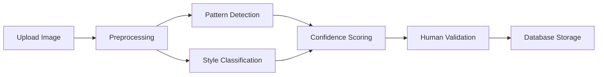

# Cahier des Charges - Symbolica
## Plateforme collaborative de découverte et d'analyse des symboles culturels

### Version 2.0 - Document complet
### Date : Décembre 2024

---

## Table des matières

1. [Contexte et Vision](#contexte-et-vision)
2. [Objectifs du Projet](#objectifs-du-projet)
3. [Public Cible](#public-cible)
4. [Fonctionnalités Principales](#fonctionnalités-principales)
5. [Parcours Utilisateurs](#parcours-utilisateurs)
6. [Architecture Technique](#architecture-technique)
7. [Base de Données](#base-de-données)
8. [Interface Utilisateur](#interface-utilisateur)
9. [Stratégie Communautaire](#stratégie-communautaire)
10. [Modèle Économique](#modèle-économique)
11. [Roadmap Détaillée](#roadmap-détaillée)
12. [Analyse des Risques](#analyse-des-risques)
13. [Métriques de Succès](#métriques-de-succès)
14. [Aspects Légaux et Conformité](#aspects-légaux-et-conformité)
15. [Stratégie de Partenariats](#stratégie-de-partenariats)
16. [Annexes Techniques](#annexes-techniques)

---

## 1. Contexte et Vision

### 1.1 Problématique
Les symboles culturels sont dispersés dans de nombreuses institutions, publications et collections privées, rendant difficile leur étude comparative et leur compréhension globale. Les chercheurs, étudiants et passionnés manquent d'outils pour :
- Identifier et analyser les motifs récurrents
- Comprendre les connexions entre cultures
- Contribuer à la préservation du patrimoine symbolique
- Accéder à des analyses automatisées par IA

### 1.2 Vision
Créer la première plateforme mondiale collaborative pour la découverte, l'analyse et la préservation des symboles culturels, en démocratisant l'accès à ce patrimoine grâce à l'intelligence artificielle et la participation communautaire.

### 1.3 Mission
- **Préserver** : Sauvegarder le patrimoine symbolique mondial
- **Analyser** : Utiliser l'IA pour révéler des patterns cachés
- **Connecter** : Relier les communautés autour des symboles
- **Éduquer** : Transmettre les connaissances culturelles

---

## 2. Objectifs du Projet

### 2.1 Objectifs à Court Terme (6 mois)
- Lancer la plateforme avec 1000+ symboles documentés
- Atteindre 500 utilisateurs actifs mensuels
- Développer les fonctionnalités d'annotation IA
- Établir 5 partenariats institutionnels

### 2.2 Objectifs à Moyen Terme (1-2 ans)
- 10 000+ symboles dans la base de données
- 5 000 utilisateurs actifs mensuels
- 20 partenariats avec musées et universités
- Modèle économique viable

### 2.3 Objectifs à Long Terme (3-5 ans)
- 100 000+ symboles documentés
- 50 000 utilisateurs dans 50 pays
- Reconnaissance comme référence académique
- Impact mesurable sur la recherche culturelle

---

## 3. Public Cible

### 3.1 Utilisateurs Primaires

#### 3.1.1 Chercheurs et Académiques
- **Profil** : Historiens, anthropologues, archéologues
- **Besoins** : Analyse comparative, publication, citation
- **Comportement** : Recherche approfondie, contribution experte

#### 3.1.2 Étudiants
- **Profil** : Étudiants en sciences humaines, arts, histoire
- **Besoins** : Ressources pédagogiques, projets académiques
- **Comportement** : Exploration, apprentissage, partage

#### 3.1.3 Passionnés et Curieux
- **Profil** : Amateurs d'histoire, voyageurs, artistes
- **Besoins** : Découverte, compréhension, inspiration
- **Comportement** : Navigation intuitive, partage social

### 3.2 Utilisateurs Secondaires

#### 3.2.1 Institutions Culturelles
- **Profil** : Musées, bibliothèques, centres culturels
- **Besoins** : Valorisation des collections, collaboration
- **Comportement** : Contribution institutionnelle, partenariats

#### 3.2.2 Éducateurs
- **Profil** : Professeurs, guides, médiateurs culturels
- **Besoins** : Ressources pédagogiques, outils d'enseignement
- **Comportement** : Création de contenu éducatif

---

## 4. Fonctionnalités Principales

### 4.1 Phase 1 (MVP - Complétée)
✅ **Exploration de symboles**
- Base de données de symboles avec métadonnées culturelles
- Interface de recherche et filtrage avancé
- Visualisation sur carte interactive
- Système de collections personnalisées

✅ **Contribution communautaire**
- Upload et documentation de nouveaux symboles
- Système de tags et catégorisation
- Géolocalisation des découvertes
- Validation par modération

✅ **Analyse par IA**
- Reconnaissance automatique de motifs
- Annotation intelligente des images
- Suggestions de patterns similaires
- Extraction de caractéristiques visuelles

### 4.2 Phase 2 (En cours)
🔄 **Fonctionnalités sociales avancées**
- Profils utilisateurs enrichis
- Système de réputation et badges
- Groupes d'intérêt thématiques
- Forums de discussion par symbole

🔄 **Outils d'analyse avancés**
- Comparaison visuelle de symboles
- Analyse des évolutions temporelles
- Détection de connexions culturelles
- Exportation de données pour recherche

🔄 **Amélioration de l'IA**
- Modèles de reconnaissance plus précis
- Classification automatique des styles
- Détection de variantes régionales
- Prédiction de significations

### 4.3 Phase 3 (Prévue)
📋 **Plateforme académique**
- Système de peer-review
- Publication d'articles de recherche
- Citations et références académiques
- API pour intégrations externes

📋 **Fonctionnalités avancées**
- Réalité augmentée pour exploration
- Recommandations personnalisées
- Analyse de sentiment communautaire
- Traduction automatique multilingue

---

## 5. Parcours Utilisateurs

### 5.1 Parcours du Visiteur Découvreur

#### Objectif : Découvrir et comprendre les symboles culturels

**Étapes :**
1. **Arrivée** : Page d'accueil avec symboles mis en avant
2. **Exploration** : Navigation par culture, période ou carte
3. **Découverte** : Consultation détaillée d'un symbole
4. **Approfondissement** : Exploration de symboles similaires
5. **Engagement** : Inscription pour sauvegarder des favoris

**Points de friction à éviter :**
- Interface trop complexe dès l'arrivée
- Manque d'explications sur les symboles
- Navigation confuse entre les sections

### 5.2 Parcours du Contributeur Passionné

#### Objectif : Partager ses découvertes et enrichir la base

**Étapes :**
1. **Inscription** : Création de compte avec validation email
2. **Orientation** : Tutorial des fonctionnalités de contribution
3. **Première contribution** : Upload d'un symbole avec guidage
4. **Validation** : Processus de modération et feedback
5. **Évolution** : Montée en niveau et obtention de badges
6. **Expertise** : Accès aux fonctionnalités de modération

**Motivations à maintenir :**
- Reconnaissance de la contribution
- Feedback constructif rapide
- Gamification et progression visible

### 5.3 Parcours du Chercheur Expert

#### Objectif : Mener des recherches approfondies et publier

**Étapes :**
1. **Recherche avancée** : Utilisation des filtres complexes
2. **Analyse comparative** : Outils de comparaison de symboles
3. **Export de données** : Téléchargement pour analyse externe
4. **Collaboration** : Échange avec autres chercheurs
5. **Publication** : Partage des résultats de recherche
6. **Citation** : Référencement académique des découvertes

**Besoins spécifiques :**
- Accès API pour intégrations
- Formats d'export standardisés
- Système de citation robuste

---

## 6. Architecture Technique

### 6.1 Stack Technologique

#### Frontend
- **Framework** : React 18 avec TypeScript
- **Styling** : Tailwind CSS + Shadcn/ui
- **État** : Tanstack React Query pour le cache
- **Routing** : React Router v6
- **Cartes** : Mapbox GL JS
- **Annotations** : Canvas API pour annotations d'images

#### Backend
- **Database** : Supabase (PostgreSQL)
- **Authentication** : Supabase Auth
- **Storage** : Supabase Storage pour images
- **Edge Functions** : Deno pour logique métier
- **AI/ML** : Intégration OpenAI pour analyse d'images

#### Infrastructure
- **Hosting** : Vercel/Netlify pour le frontend
- **CDN** : Cloudflare pour optimisation
- **Monitoring** : Sentry pour error tracking
- **Analytics** : Mixpanel pour usage tracking

### 6.2 Architecture Système

```
┌─────────────────┐    ┌─────────────────┐    ┌─────────────────┐
│   Frontend      │    │   Supabase      │    │   Services      │
│   React App     │◄──►│   PostgreSQL    │◄──►│   OpenAI API    │
│                 │    │   Auth & Storage│    │   Mapbox API    │
└─────────────────┘    └─────────────────┘    └─────────────────┘
         │                       │                       │
         │              ┌─────────────────┐             │
         └─────────────►│  Edge Functions │◄────────────┘
                        │  AI Processing  │
                        └─────────────────┘
```

### 6.3 Sécurité

#### Authentification et Autorisation
- JWT tokens avec rotation automatique
- Row Level Security (RLS) sur toutes les tables
- Rôles utilisateurs : visiteur, contributeur, modérateur, admin

#### Protection des Données
- Chiffrement en transit (HTTPS/TLS)
- Chiffrement au repos pour données sensibles
- Sauvegarde automatique quotidienne
- Conformité RGPD

#### Sécurité API
- Rate limiting par utilisateur
- Validation stricte des inputs
- Sanitization des uploads d'images
- Monitoring des accès suspects

---

## 7. Base de Données

### 7.1 Modèle de Données Principal

#### Tables Core
- **symbols** : Métadonnées des symboles
- **symbol_images** : Images et variantes
- **patterns** : Motifs identifiés
- **image_annotations** : Annotations sur images

#### Tables Utilisateurs
- **profiles** : Profils utilisateurs étendus
- **user_contributions** : Contributions des utilisateurs
- **user_activities** : Historique d'activité
- **user_achievements** : Système de gamification

#### Tables Communautaires
- **collections** : Collections de symboles
- **interest_groups** : Groupes thématiques
- **group_posts** : Publications dans les groupes
- **post_comments** : Commentaires et discussions

### 7.2 Relations Clés

```sql
symbols 1:N symbol_images
symbols 1:N patterns
symbol_images 1:N image_annotations
patterns 1:N image_annotations
symbols N:M collections (via collection_symbols)
users 1:N user_contributions
users N:M interest_groups (via group_members)
```

### 7.3 Optimisations

#### Index et Performance
- Index GiST pour recherche géographique
- Index GIN pour recherche full-text
- Index composites pour requêtes complexes
- Partitioning pour tables volumineuses

#### Évolutivité
- Séparation lecture/écriture
- Cache Redis pour requêtes fréquentes
- CDN pour assets statiques
- Archive automatique des données anciennes

---

## 8. Interface Utilisateur

### 8.1 Principes de Design

#### Accessibilité
- Conformité WCAG 2.1 AA
- Support des lecteurs d'écran
- Navigation au clavier
- Contraste suffisant pour malvoyants

#### Responsive Design
- Mobile-first approach
- Breakpoints : 320px, 768px, 1024px, 1440px
- Touch-friendly sur mobile
- Optimisation des images par taille d'écran

#### Performance UX
- Lazy loading des images
- Skeleton loaders pendant chargement
- Pagination infinie pour listes
- Préchargement intelligent

### 8.2 Composants Clés

#### Navigation
- Header persistant avec recherche
- Menu burger responsive
- Breadcrumbs pour orientation
- Sidebar contextuelle

#### Exploration
- Grille de symboles avec filtres
- Carte interactive avec clusters
- Visualisation en timeline
- Comparateur de symboles

#### Contribution
- Formulaire multi-étapes
- Upload drag-and-drop
- Prévisualisation en temps réel
- Validation progressive

---

## 9. Stratégie Communautaire

### 9.1 Animation Communautaire

#### Programme d'Ambassadeurs
- **Objectif** : 50 ambassadeurs actifs dans 20 pays
- **Profil** : Experts reconnus, influenceurs culturels
- **Avantages** : Accès anticipé, badge spécial, événements
- **Responsabilités** : Modération, animation, promotion

#### Événements Communautaires
- **Challenges mensuels** : Thèmes de contribution
- **Webinaires experts** : Conférences avec chercheurs
- **Concours photo** : Meilleurs symboles découverts
- **Hackathons** : Développement de nouvelles fonctionnalités

### 9.2 Gamification

#### Système de Points
- **Contribution** : 100 points par symbole validé
- **Validation** : 50 points par annotation correcte
- **Social** : 25 points par commentaire constructif
- **Exploration** : 10 points par découverte quotidienne

#### Niveaux et Badges
- **Novice** (0-500 pts) : Découvreur, Curieux
- **Contributeur** (500-2000 pts) : Explorateur, Collectionneur
- **Expert** (2000-5000 pts) : Analyste, Mentor
- **Maître** (5000+ pts) : Sage, Ambassadeur

#### Récompenses
- **Badges visuels** sur profil et contributions
- **Accès anticipé** aux nouvelles fonctionnalités
- **Mentions** dans newsletter et réseaux sociaux
- **Cadeaux physiques** pour top contributeurs

### 9.3 Modération

#### Processus de Validation
1. **Auto-modération IA** : Détection contenu inapproprié
2. **Peer-review** : Validation par contributeurs expérimentés
3. **Modération experte** : Validation finale par équipe
4. **Feedback utilisateur** : Signalement communautaire

#### Critères de Qualité
- **Exactitude** : Métadonnées correctes et vérifiables
- **Originalité** : Pas de doublons
- **Qualité image** : Résolution et netteté suffisantes
- **Respect** : Pas de contenu offensant ou inapproprié

---

## 10. Modèle Économique

### 10.1 Sources de Revenus

#### Freemium (70% des revenus prévus)
- **Gratuit** : Accès consultation, contribution limitée
- **Premium** (€9.99/mois) : 
  - Contributions illimitées
  - Outils d'analyse avancés
  - Export de données
  - Support prioritaire

#### Partenariats Institutionnels (20% des revenus)
- **Musées** : Licence pour intégration collections
- **Universités** : Accès API et données pour recherche
- **Éditeurs** : Contenu pour publications
- **Tourisme** : Intégration applications de voyage

#### Services Professionnels (10% des revenus)
- **Consulting** : Analyse de collections privées
- **Formation** : Workshops pour institutions
- **Développement** : Solutions sur mesure
- **Certification** : Validation expertise utilisateurs

### 10.2 Projections Financières

#### Année 1
- **Utilisateurs** : 5 000 (5% premium)
- **Revenus** : €30 000
- **Coûts** : €80 000 (développement, infrastructure)
- **Résultat** : -€50 000 (phase d'investissement)

#### Année 3
- **Utilisateurs** : 25 000 (10% premium)
- **Revenus** : €400 000
- **Coûts** : €250 000 (équipe 8 personnes)
- **Résultat** : +€150 000 (seuil de rentabilité)

#### Année 5
- **Utilisateurs** : 75 000 (15% premium)
- **Revenus** : €1 500 000
- **Coûts** : €800 000 (équipe 15 personnes)
- **Résultat** : +€700 000 (croissance stable)

---

## 11. Roadmap Détaillée

### 11.1 Phase 1 : Fondations (Complétée - Mois 1-6)

#### Développement Core ✅
- Architecture technique et base de données
- Interface utilisateur responsive
- Système d'authentification
- Upload et gestion des symboles

#### Fonctionnalités IA ✅
- Reconnaissance de patterns basique
- Annotation semi-automatique
- Suggestions de tags
- Détection de doublons

#### Communauté ✅
- Système de contribution
- Modération basique
- Profils utilisateurs
- Collections personnelles

### 11.2 Phase 2 : Enrichissement (Mois 7-12)

#### T1 2025 - Fonctionnalités Sociales
- **Semaine 1-4** : Groupes d'intérêt thématiques
- **Semaine 5-8** : Système de messagerie
- **Semaine 9-12** : Forums et discussions

#### T2 2025 - Outils d'Analyse
- **Semaine 13-16** : Comparateur de symboles
- **Semaine 17-20** : Analyse temporelle
- **Semaine 21-24** : Export données recherche

#### T3 2025 - IA Avancée
- **Semaine 25-28** : Modèles de reconnaissance améliorés
- **Semaine 29-32** : Classification automatique styles
- **Semaine 33-36** : Détection connexions culturelles

#### T4 2025 - Partenariats
- **Semaine 37-40** : API pour intégrations externes
- **Semaine 41-44** : Interface partenaires institutionnels
- **Semaine 45-48** : Lancement programme ambassadeurs

### 11.3 Phase 3 : Expansion (Année 2-3)

#### Fonctionnalités Avancées
- Réalité augmentée pour exploration
- Recommandations personnalisées par IA
- Traduction automatique multilingue
- Système de peer-review académique

#### Expansion Géographique
- Localisation en 10 langues
- Partenariats régionaux (Asie, Afrique, Amériques)
- Événements physiques dans grandes villes
- Collaboration avec UNESCO

#### Monétisation
- Lancement abonnements premium
- Partenariats commerciaux
- Services consulting
- Marketplace pour ressources pédagogiques

---

## 12. Analyse des Risques

### 12.1 Risques Techniques

#### Risque : Scalabilité de la base de données
- **Probabilité** : Moyenne
- **Impact** : Élevé
- **Mitigation** : 
  - Architecture microservices
  - Sharding horizontal prévu
  - Monitoring proactif des performances
  - Plan de migration cloud

#### Risque : Qualité des modèles IA
- **Probabilité** : Moyenne
- **Impact** : Moyen
- **Mitigation** :
  - Dataset d'entraînement diversifié
  - Validation humaine systématique
  - Amélioration continue des modèles
  - Fallback sur modération humaine

### 12.2 Risques Communautaires

#### Risque : Contenu inapproprié ou biaisé
- **Probabilité** : Élevée
- **Impact** : Élevé
- **Mitigation** :
  - Modération proactive multiculturelle
  - Guidelines communautaires claires
  - Formation des modérateurs
  - Système de signalement efficace

#### Risque : Manque d'engagement communautaire
- **Probabilité** : Moyenne
- **Impact** : Élevé
- **Mitigation** :
  - Programme de gamification robuste
  - Animation communautaire régulière
  - Partenariats avec influenceurs
  - Valeur ajoutée claire pour utilisateurs

### 12.3 Risques Légaux et Éthiques

#### Risque : Droits d'auteur et propriété intellectuelle
- **Probabilité** : Élevée
- **Impact** : Élevé
- **Mitigation** :
  - Politique claire de licences
  - Vérification systématique des droits
  - Partenariats avec détenteurs de droits
  - Procédure DMCA établie

#### Risque : Appropriation culturelle
- **Probabilité** : Moyenne
- **Impact** : Élevé
- **Mitigation** :
  - Comité consultatif multiculturel
  - Guidelines de respect culturel
  - Collaboration avec communautés d'origine
  - Formation équipe sur sensibilité culturelle

### 12.4 Risques Financiers

#### Risque : Difficultés de financement
- **Probabilité** : Moyenne
- **Impact** : Élevé
- **Mitigation** :
  - Diversification sources de financement
  - Partenariats institutionnels solides
  - Modèle économique flexible
  - Réserves de trésorerie suffisantes

---

## 13. Métriques de Succès

### 13.1 KPIs Techniques

#### Performance Plateforme
- **Uptime** : >99.5%
- **Temps de chargement** : <2 secondes
- **Taux d'erreur** : <0.1%
- **Score PageSpeed** : >90

#### Qualité Données
- **Symboles validés** : Croissance 20% mensuelle
- **Taux de validation** : >85%
- **Qualité annotations IA** : >90% de précision
- **Doublons détectés** : <5% de la base

### 13.2 KPIs Communautaires

#### Engagement Utilisateurs
- **Utilisateurs actifs mensuels** : Objectif 50K en an 3
- **Taux de rétention** : >60% à 30 jours
- **Contributions par utilisateur** : >5 par mois (actifs)
- **Temps de session moyen** : >10 minutes

#### Croissance Communauté
- **Nouveaux utilisateurs** : Croissance 15% mensuelle
- **Contributeurs actifs** : 10% de la base utilisateurs
- **Modérateurs communautaires** : 1 pour 500 utilisateurs
- **Groupes d'intérêt** : >100 groupes actifs

### 13.3 KPIs Business

#### Revenus et Conversion
- **Taux de conversion premium** : >12%
- **Churn rate** : <5% mensuel
- **LTV/CAC ratio** : >3:1
- **ARR (Annual Recurring Revenue)** : €1M en an 3

#### Partenariats
- **Institutions partenaires** : >50 en an 3
- **API calls externes** : >1M par mois
- **Revenus partenariats** : 30% du total
- **Satisfaction partenaires** : >8/10

### 13.4 KPIs Impact

#### Rayonnement Académique
- **Publications citant Symbolica** : >100 en an 3
- **Chercheurs utilisant la plateforme** : >1000
- **Universités partenaires** : >20
- **Conférences présentations** : >10 par an

#### Impact Culturel
- **Cultures représentées** : >100
- **Langues supportées** : >15
- **Pays d'origine des symboles** : >50
- **Couverture médiatique** : >50 articles par an

---

## 14. Aspects Légaux et Conformité

### 14.1 Protection des Données (RGPD)

#### Principes Appliqués
- **Minimisation** : Collecte uniquement des données nécessaires
- **Transparence** : Information claire sur l'usage des données
- **Consentement** : Opt-in explicite pour tous les traitements
- **Portabilité** : Export des données utilisateur en format standard

#### Mesures Techniques
- **Pseudonymisation** : Données personnelles protégées
- **Chiffrement** : En transit et au repos
- **Audit logs** : Traçabilité des accès aux données
- **Droit à l'oubli** : Suppression automatisée possible

#### Procédures
- **DPO désigné** : Data Protection Officer certifié
- **DPIA** : Analyse d'impact vie privée documentée
- **Registre des traitements** : Maintenu à jour
- **Formation équipe** : Sensibilisation RGPD régulière

### 14.2 Propriété Intellectuelle

#### Politique de Licences
- **Contenu utilisateur** : Licence Creative Commons BY-SA
- **Contributions institutionnelles** : Accords spécifiques
- **Données générées par IA** : Domaine public avec attribution
- **Code source** : Open source sous licence MIT

#### Protection des Droits
- **Vérification uploads** : Système de détection duplicatas
- **Procédure DMCA** : Réponse sous 24h aux réclamations
- **Comité éthique** : Validation des contenus sensibles
- **Assurance responsabilité** : Couverture €2M

### 14.3 Modération et Sécurité

#### Règles Communautaires
- **Respect culturel** : Interdiction appropriation
- **Exactitude scientifique** : Validation par pairs
- **Civilité** : Tolérance zéro harcèlement
- **Transparence** : Sources et méthodologie

#### Outils de Modération
- **IA de détection** : Contenu inapproprié automatique
- **Signalement utilisateur** : Interface simple et rapide
- **Escalade** : Processus de résolution structuré
- **Sanctions** : Graduées selon gravité

---

## 15. Stratégie de Partenariats

### 15.1 Partenaires Institutionnels

#### Musées et Centres Culturels
- **Objectif** : 20 partenariats majeurs en 2 ans
- **Proposition de valeur** :
  - Numérisation et valorisation collections
  - Nouvelle audience digitale
  - Outils d'analyse pour conservateurs
  - Revenus partagés sur premium

**Partenaires cibles prioritaires :**
- Musée du Louvre (Paris)
- British Museum (Londres)
- Metropolitan Museum (New York)
- Musée National de Tokyo
- Smithsonian Institution (Washington)

#### Universités et Centres de Recherche
- **Objectif** : 30 partenariats académiques
- **Proposition de valeur** :
  - Accès API pour recherche
  - Dataset pour projets étudiants
  - Publication conjointe résultats
  - Formation équipes recherche

**Programmes spécifiques :**
- Bourses de recherche Symbolica
- Concours étudiants meilleure analyse
- Workshops méthodologie IA culturelle
- Certification expertise symboles

### 15.2 Partenaires Technologiques

#### Fournisseurs IA
- **OpenAI** : Modèles vision et traitement langage
- **Google Cloud** : Services ML et infrastructure
- **Hugging Face** : Modèles open source spécialisés
- **Anthropic** : Analyse sémantique avancée

#### Plateformes Éducatives
- **Coursera** : Cours sur analyse symboles
- **edX** : MOOC patrimoine culturel digital
- **Khan Academy** : Modules grand public
- **UNESCO Learning** : Programmes officiels

### 15.3 Partenaires Commerciaux

#### Tourisme et Culture
- **GetYourGuide** : Intégration visites guidées
- **Airbnb Experiences** : Ateliers découverte symboles
- **National Geographic** : Contenus éditoriaux
- **Lonely Planet** : Guides enrichis symboles

#### Médias et Édition
- **Arte** : Documentaires collaboratifs
- **France Culture** : Podcasts découvertes
- **Flammarion** : Édition livres spécialisés
- **Taschen** : Beaux livres symboles

---

## 16. Annexes Techniques

### 16.1 Architecture API

#### Endpoints Principaux

```
# Symboles
GET /api/v1/symbols - Liste avec filtres
GET /api/v1/symbols/{id} - Détail symbole
POST /api/v1/symbols - Création (auth requise)
PUT /api/v1/symbols/{id} - Modification (auth requise)

# Recherche
GET /api/v1/search?q={query}&filters={filters}
GET /api/v1/search/similar?imageUrl={url}
POST /api/v1/search/ai-analysis

# Collections
GET /api/v1/collections - Collections publiques
GET /api/v1/users/{id}/collections - Collections utilisateur
POST /api/v1/collections - Création collection

# Utilisateurs
GET /api/v1/users/{id}/profile
PUT /api/v1/users/{id}/profile (auth requise)
GET /api/v1/users/{id}/contributions
```

#### Authentification
- **Type** : Bearer Token (JWT)
- **Durée** : 24h avec refresh automatique
- **Scopes** : read, write, moderate, admin

### 16.2 Schéma de Base de Données

#### Table symbols
```sql
CREATE TABLE symbols (
  id UUID PRIMARY KEY DEFAULT gen_random_uuid(),
  name TEXT NOT NULL,
  culture TEXT NOT NULL,
  period TEXT NOT NULL,
  description TEXT,
  medium TEXT[],
  technique TEXT[],
  function TEXT[],
  translations JSONB DEFAULT '{}',
  created_at TIMESTAMP WITH TIME ZONE DEFAULT NOW(),
  updated_at TIMESTAMP WITH TIME ZONE DEFAULT NOW()
);
```

#### Table patterns
```sql
CREATE TABLE patterns (
  id UUID PRIMARY KEY DEFAULT gen_random_uuid(),
  symbol_id UUID REFERENCES symbols(id),
  name TEXT NOT NULL,
  pattern_type TEXT CHECK (pattern_type IN ('geometric', 'figurative', 'abstract', 'decorative')),
  complexity_level TEXT CHECK (complexity_level IN ('simple', 'medium', 'complex')),
  cultural_significance TEXT,
  historical_context TEXT,
  created_by UUID REFERENCES auth.users(id),
  created_at TIMESTAMP WITH TIME ZONE DEFAULT NOW()
);
```

### 16.3 Spécifications IA

#### Modèles de Reconnaissance

**Pattern Detection Model**
- **Architecture** : ResNet-50 + Custom CNN layers
- **Dataset** : 50K images annotées manuellement
- **Précision** : 92% sur dataset test
- **Latence** : <2s par image

**Style Classification Model**
- **Architecture** : Vision Transformer (ViT-B/16)
- **Classes** : 25 styles culturels principaux
- **Précision** : 88% classification fine-grained
- **Update** : Ré-entraînement mensuel

#### Pipeline de Traitement



### 16.4 Guides de Contribution

#### Standards de Qualité Images
- **Résolution minimum** : 800x600 pixels
- **Formats acceptés** : JPEG, PNG, WebP
- **Taille maximum** : 10MB
- **Qualité requise** : Netteté suffisante pour analyse

#### Métadonnées Obligatoires
- **Nom du symbole** : Appellation courante
- **Culture d'origine** : Peuple/civilisation
- **Période historique** : Siècle ou ère
- **Localisation** : Région géographique
- **Source** : Origine de l'information

#### Processus de Validation
1. **Upload** : Vérification technique automatique
2. **Pré-modération** : IA détection contenu inapproprié
3. **Peer-review** : Validation par contributeurs expérimentés
4. **Validation experte** : Contrôle final par équipe
5. **Publication** : Mise en ligne avec crédit

---

## Conclusion

Ce cahier des charges détaille la vision complète de Symbolica, plateforme collaborative dédiée à la découverte et l'analyse des symboles culturels mondiaux. Le projet combine technologie avancée (IA, machine learning) et engagement communautaire pour créer un outil unique au service de la préservation du patrimoine symbolique.

### Prochaines Étapes Immédiates

1. **Validation stakeholders** : Présentation aux partenaires potentiels
2. **Finalisation technique** : Complétion des fonctionnalités Phase 2
3. **Lancement programme bêta** : Onboarding des premiers ambassadeurs
4. **Recherche financement** : Levée de fonds pour accélération
5. **Recrutement équipe** : Développeurs, community managers, chercheurs

### Vision 2030

Symbolica ambitionne de devenir la référence mondiale pour l'étude des symboles culturels, contribuant à une meilleure compréhension des connexions entre civilisations et à la préservation du patrimoine symbolique de l'humanité.

---

**Document Version** : 2.0  
**Dernière mise à jour** : Décembre 2024  
**Équipe Projet** : Symbolica Core Team  
**Contact** : contact@symbolica.org
